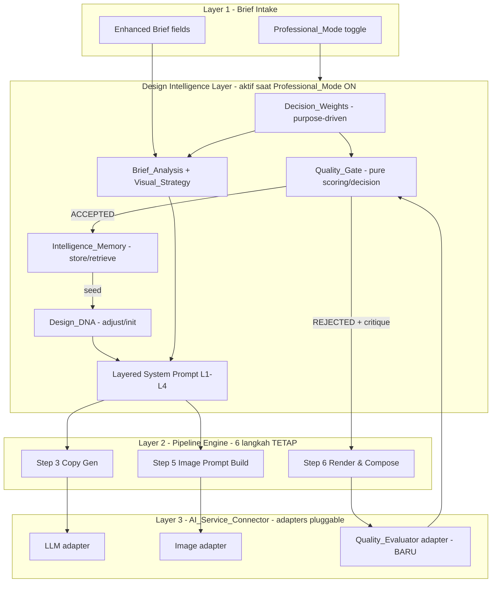
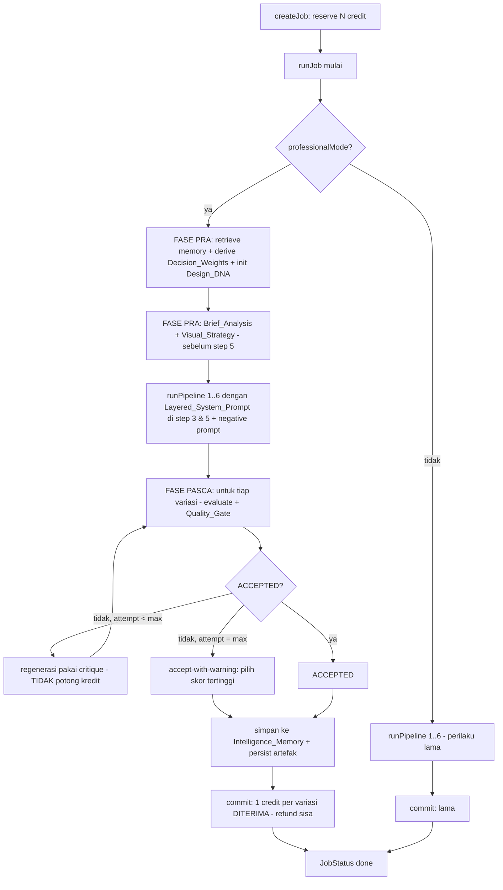
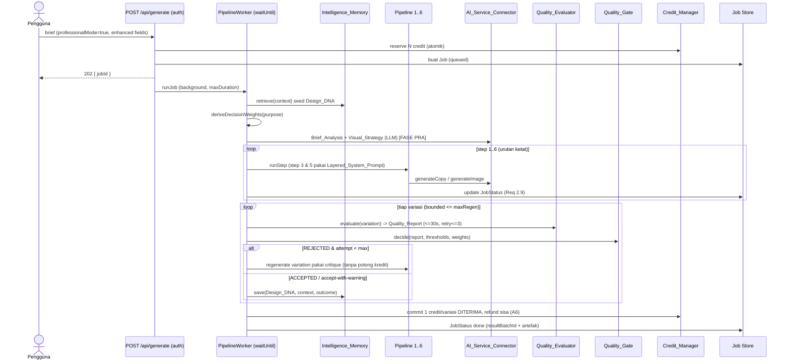

# Design Document

## Overview

Design Intelligence System adalah **lapisan aditif** di atas Feed Design Generator yang sudah terimplementasi (lihat `.kiro/specs/feed-design-generator/`). Lapisan ini membuat sistem menalar, mengevaluasi, dan belajar seperti **senior art director**: merancang dengan tujuan (purpose-driven), menalar eksplisit sebelum membuat, mengkritik hasilnya, lalu belajar dari umpan balik.

Prinsip desain non-negotiable: lapisan ini **membungkus** dan **memperkaya** pipeline 6-langkah yang ada — Brand DNA Extraction → Design System Selection → Copy Generation → Layout Composition → Image Prompt Build → Render & Compose — **tanpa menambah, menghapus, melompati, atau mengubah urutan** keenam langkah (Req 1.5, 11.1). Seluruh kapabilitas baru aktif **hanya** ketika `Professional_Mode` menyala (Req 1), dan ketika padam pipeline berjalan persis seperti sekarang (perilaku bawaan tidak berubah, Req 1.2).

Desain ini menargetkan deployment **Vercel** dan menghormati seluruh batasan platform yang sudah ditetapkan pada desain dasar: model eksekusi **asinkron berbasis job** (`POST /api/generate` → `jobId` → worker background → polling `GET /api/jobs/{jobId}`), runtime `nodejs` dengan `maxDuration` terkonfigurasi, tanpa filesystem persisten, koneksi DB pooled, rahasia hanya di sisi server, dan seluruh layanan AI diakses melalui adapter yang *pluggable* + *mockable*.

### Cara Lapisan Ini Menempel pada Sistem yang Ada

Lapisan Design Intelligence terdiri atas **modul-modul logika murni baru** di bawah `lib/intelligence/*`, **satu adapter AI baru** (`Quality_Evaluator`) yang ditambahkan ke `AI_Service_Connector`, **perluasan tipe** (bukan perubahan yang merusak) pada `lib/types.ts`, **perluasan worker** (`lib/pipeline/worker.ts`) untuk menjalankan analisis pra-generasi dan loop quality-gate pasca-render, serta **endpoint baru** untuk refinement dan penayangan artefak. Semua titik integrasi memanfaatkan seam yang sudah ada:

| Kebutuhan integrasi | Seam yang sudah ada yang dipakai |
|---|---|
| Threading flag + brief profesional | `DesignBriefInput` (diperluas), `start()` di `engine.ts`, `PipelineState` |
| Prompt berlapis ke step 3 & 5 | `StepTransform` injectable + `StepTransformsOptions` di `steps.ts` |
| Evaluator AI baru | `AIServiceConnector` (method baru) + pola `MockAIServiceConnector`/`MockAdapter` + `callWithRetry` |
| Loop regenerasi quality-gate | `PipelineWorker.runJob` (setelah `runPipeline` sukses & sebelum commit kredit) |
| Inisialisasi DNA dari memori | seam baru `getIntelligenceMemory()` mengikuti pola `getVariationStore()`/`getHistoryManager()` |
| Refinement endpoint | pola `app/api/variations/[id]/route.ts` + `derive.ts` + `getVariationStore()` |
| Kebijakan kredit | `CreditManager.reserve/commit/refund` (commit bergeser dari "per reservasi" ke "per variasi diterima") |
| Persistensi | model Prisma baru, mengikuti pola `PrismaJobStore`/in-memory drop-in |

### Tujuan & Batasan

- **Aditif & non-destruktif**: tidak ada perubahan yang merusak kontrak tipe/komponen yang ada. Field baru bersifat opsional; perilaku baru di-*gate* oleh `professionalMode`.
- **Urutan 6-langkah tetap utuh**: analisis pra-generasi (Design_Brief_Analysis + Visual_Strategy) berjalan **sebelum** step 5 (Image Prompt Build) dengan menyuntik transform & memperkaya prompt step 3/5 — bukan langkah ke-7. Evaluasi + quality-gate + regenerasi berjalan **setelah** step 6 selesai, di dalam worker, sebagai loop di sekitar render — bukan langkah baru di dalam state machine.
- **Mockable**: `Quality_Evaluator` adalah adapter; seluruh modul memori, prompt builder, dan scoring murni & deterministik agar dapat diuji dengan fast-check (100+ iterasi).
- **Privasi**: `Intelligence_Memory` menyimpan hanya `Design_DNA` + konteks teragregasi (industri, purpose, audiens) + outcome — **tanpa PII brief mentah** (Req 9.5), retensi 365 hari (Req 9.7), dapat dihapus per pengguna (Req 9.6).

### Default yang Diadopsi dari Asumsi (A1–A10)

Desain mengkodekan default berikut sebagai **konstanta yang dapat dikonfigurasi** (Req 6.9), sesuai asumsi pada requirements:

- A1: Quality_Score = bilangan bulat 1–10.
- A2: 7 kriteria default — Hierarchy, Readability, Composition, Branding Consistency, Originality, Premium Perception, Whitespace.
- A3: ambang per-kriteria — Readability ≥ 8, Branding Consistency ≥ 8, sisanya ≥ 7.
- A4: ambang total berbobot ≥ 7.5/10.
- A5: maksimum 3 percobaan regenerasi quality-gate per variasi.
- A6: regenerasi internal quality-gate **tidak** memotong kredit; hanya 1 kredit per variasi final diterima.
- A7: rating refinement 1–10 (saluran terpisah dari rating riwayat 1–5; rekonsiliasi di §Data Models).
- A8: retensi memori 365 hari, tanpa PII, dapat dihapus pengguna.
- A9: `Professional_Mode` default **nonaktif**.
- A10: total latensi (analisis + evaluasi + regenerasi) dibatasi agar tetap dalam `maxDuration` worker; jumlah percobaan dibatasi (A5).

## Architecture

### Posisi Lapisan dalam Arsitektur 6-Layer

Lapisan Design Intelligence menyisip sebagai **lapisan kognitif** yang membungkus Layer 2 (Pipeline_Engine) dan Layer 3 (AI_Service_Connector) yang ada, serta menambah satu store pembelajaran. Pipeline 6-langkah tetap menjadi tulang punggung.



### Pemetaan ke Worker dan Pipeline yang Ada

Eksekusi tetap sepenuhnya berada di dalam `PipelineWorker.runJob` (background, Vercel `waitUntil`/queue). Lapisan menambahkan tiga fase **di dalam** invokasi worker yang sama, tanpa mengubah state machine 1→6:



Catatan kunci:
- **State machine 1→6 tidak berubah.** Quality-gate/regenerasi adalah loop **di sekitar** step 6 (render satu variasi), bukan langkah baru. `engine.ts`/`failure.ts` tetap menjalankan urutan ketat per render.
- **Brief_Analysis & Visual_Strategy** diproduksi pada **FASE PRA** dan disimpan di `PipelineState` (field baru opsional) sehingga transform step 3 & 5 dapat mengonsumsinya saat menyusun prompt berlapis — keduanya selesai sebelum step 5 dijalankan (Req 4.1).
- **Evaluasi & regenerasi** berjalan di worker, bukan pada request awal (Req 5.9, 8.9, 11.2).

### Alur Job Asinkron yang Diperluas (Professional_Mode ON)



### Keamanan

Seluruh endpoint baru (`/api/refine/[id]`, `/api/batches/[id]/intelligence`, `/api/intelligence-memory`) WAJIB melewati middleware autentikasi yang ada dan otorisasi kepemilikan via `authorizeOwnership` (Req 11.6), persis seperti endpoint yang ada. Adapter `Quality_Evaluator` memakai env var sisi-server saja (tanpa `NEXT_PUBLIC_`), konsisten dengan adapter lain. `Intelligence_Memory` tidak menyimpan PII (Req 9.5).

### Catatan Deployment Vercel

- Seluruh panggilan AI tambahan (analisis, evaluasi) + regenerasi berjalan **di dalam worker** ber-`maxDuration` (Pro: 300s), bukan request awal (Req 5.9, 11.2, 11.7).
- Anggaran waktu (A10): dengan timeout evaluator 30s (Req 5.1) dan maksimum 3 regenerasi/variasi (A5), worker membatasi total percobaan agar tetap dalam `maxDuration`. `Quality_Gate` mengekspos `maxRegenerationAttempts` yang dikonfigurasi (Req 6.9, 6.10).
- Endpoint refinement memakai pola async/worker yang sama (Req 8.9): regenerasi dijalankan di background, bukan menahan request.

## Components and Interfaces

Antarmuka ditulis sebagai kontrak TypeScript yang konsisten dengan gaya modul yang ada (interface eksplisit, adapter injectable, default in-memory, fungsi murni). Modul baru berada di `lib/intelligence/*`.

### Professional_Mode threading (Req 1, 11)

`Professional_Mode` adalah flag boolean yang di-*thread* dari brief → job → worker → pipeline state. Tidak ada komponen baru; hanya perluasan tipe (lihat Data Models) dan satu helper gating.

```ts
// lib/intelligence/professional-mode.ts
/** Default nonaktif (A9). */
export const PROFESSIONAL_MODE_DEFAULT = false;

/** Resolusi flag dari brief; absen -> default nonaktif (Req 1.4). */
export function resolveProfessionalMode(brief: DesignBriefInput): boolean {
  return brief.professionalMode ?? PROFESSIONAL_MODE_DEFAULT;
}
```

Worker bercabang pada flag ini: padam → jalur lama persis; nyala → aktifkan fase PRA + PASCA (Req 1.2, 1.3). Urutan 6-langkah identik di kedua cabang (Req 1.5).

### Enhanced Brief_Intake (Req 2)

Memperluas validasi `lib/intake/brief-intake.ts` yang ada dengan validasi field profesional **bersyarat** (`professionalMode === true`). Tidak mengubah `validateBrief` lama; menambah lapisan.

```ts
// lib/intelligence/professional-brief.ts
export const CORE_MESSAGE_MAX_WORDS = 7;          // Req 2.3
export const DESIGN_PURPOSES = [
  "Marketing_Conversion", "Branding_Awareness", "Education", "Engagement",
] as const;
export type DesignPurpose = (typeof DESIGN_PURPOSES)[number];

export interface ProfessionalBriefFields {
  designPurpose: DesignPurpose;                    // wajib (Req 2.2, 2.5)
  audience: { age?: string; profession?: string; painPoint?: string }; // Req 2.1
  primaryGoal: string;                             // wajib (Req 2.5)
  emotionTarget: string;                           // Req 2.1
  coreMessage: string;                             // wajib, <= 7 kata (Req 2.3, 2.5)
}

/** Hitung kata non-kosong (whitespace-collapsed) untuk batas 7 kata. */
export function countWords(text: string): number;

/**
 * Validasi tambahan saat professionalMode ON. Mengembalikan errors +
 * preservedValues (Req 2.4, 2.6 — pertahankan field lain tanpa perubahan).
 * Saat professionalMode OFF -> valid tanpa cek field profesional.
 */
export function validateProfessionalBrief(brief: DesignBriefInput): ValidationResult;
```

Aturan: core message > 7 kata → tolak field core message dengan pesan menyebut batas 7 kata (Req 2.4); field wajib kosong (designPurpose/primaryGoal/coreMessage) → tolak menyebut field yang kurang (Req 2.6); seluruh nilai lain dipertahankan. Unggahan referensi memakai `validateUpload` yang ada (Req 2.7).

### Decision_Weights — purpose-driven (Req 7)

Modul **murni, rule-based** yang menurunkan bobot per kriteria + urutan prioritas dari `Design_Purpose`.

```ts
// lib/intelligence/decision-weights.ts
export interface DecisionWeights {
  /** Bobot per kriteria (>0). Dinormalisasi sehingga total = 1.0. */
  weights: Record<QualityCriterionName, number>;
  /** Urutan prioritas kriteria, paling tinggi dulu. */
  priority: QualityCriterionName[];
  purpose: DesignPurpose;
}

/**
 * Aturan rule-based (Req 7.1-7.5):
 *  - Marketing_Conversion -> Hierarchy & Readability tertinggi
 *  - Branding_Awareness   -> Branding Consistency & Premium Perception tertinggi
 *  - Education            -> Readability & Hierarchy tertinggi
 *  - Engagement           -> Originality & Composition tertinggi
 * Kriteria yang diprioritaskan SELALU memiliki bobot > kriteria non-prioritas.
 */
export function deriveDecisionWeights(purpose: DesignPurpose): DecisionWeights;
```

Bobot dinormalisasi (jumlah = 1.0) sehingga skor total berbobot tetap pada skala 1–10. `priority` dipakai `Visual_Strategy` untuk keputusan hierarchy/composition (Req 7.7) dan `Quality_Gate` memakai `weights` untuk agregasi (Req 7.6).

### Layered System Prompt builder (Req 3)

Modul murni yang menyusun empat lapisan dalam urutan tetap L1→L2→L3→L4 (Req 3.1, 3.2), dipakai untuk memperkaya prompt step 3 (Copy) & step 5 (Image Prompt Build).

```ts
// lib/intelligence/prompt-layers.ts
export interface LayeredSystemPromptInput {
  briefAnalysis: DesignBriefAnalysis;     // untuk L2 context
  visualStrategy?: VisualStrategy;        // untuk L2 context
  criteria: QualityCriterion[];           // untuk L3 (kriteria + threshold)
  decisionWeights: DecisionWeights;       // untuk L4 (Design_DNA weights)
  designDna: DesignDNA;                    // untuk L4
}

export interface LayeredSystemPrompt {
  l1Identity: string;       // persona senior art director (Req 3.3)
  l2Thinking: string;       // proses berpikir wajib -> analysis & strategy (Req 3.4)
  l3QualityGate: string;    // daftar kriteria + threshold (Req 3.5)
  l4DesignDnaWeights: string; // bobot dari Decision_Weights (Req 3.6)
  /** Komposisi final L1\nL2\nL3\nL4 dalam urutan tetap (Req 3.2). */
  composed: string;
}

export function buildLayeredSystemPrompt(
  input: LayeredSystemPromptInput,
): LayeredSystemPrompt;

/** Sisipkan composed prompt ke depan prompt langkah tanpa mengubah urutan pipeline (Req 3.7). */
export function applyLayeredPrompt(basePrompt: string, layered: LayeredSystemPrompt): string;
```

Integrasi: `createStepTransforms` (di `steps.ts`) menerima opsi baru `intelligence?: { layeredPrompt, negativePrompt }`. Saat hadir, step 3 menambahkan `composed` sebagai system prompt ke `CopyRequest`, dan step 5 (`buildImagePrompt`) menambahkan `composed` + memperkuat `negativePrompt` (Req 3.7, 10.2). Saat absen (mode dasar), perilaku lama dipertahankan.

### Brief_Analysis & Visual_Strategy (Req 4)

Diproduksi pada FASE PRA via `AI_Service_Connector` (LLM), disimpan bersama batch.

```ts
// lib/intelligence/brief-analysis.ts
export interface BriefAnalysisInput {
  brief: DesignBriefInput;
  professional: ProfessionalBriefFields;
}
/** Bangun Design_Brief_Analysis (Req 4.2). LLM-backed via connector; mockable. */
export async function buildBriefAnalysis(
  input: BriefAnalysisInput,
  connector: AIServiceConnector,
  opts?: ConnectorCallOptions,
): Promise<DesignBriefAnalysis>;

// lib/intelligence/visual-strategy.ts
/** Bangun Visual_Strategy memakai urutan prioritas Decision_Weights (Req 4.3, 7.7). */
export async function buildVisualStrategy(
  analysis: DesignBriefAnalysis,
  weights: DecisionWeights,
  designDna: DesignDNA,
  connector: AIServiceConnector,
  opts?: ConnectorCallOptions,
): Promise<VisualStrategy>;
```

Kegagalan pembuatan artefak → worker menghentikan job pada fase tersebut, refund kredit, pertahankan brief (Req 4.6) — memakai jalur refund worker yang ada. Endpoint penayangan: `GET /api/batches/[id]/intelligence` (Req 4.5, terautentikasi).

### Quality_Evaluator adapter (Req 5, 10)

Adapter AI **baru** yang ditambahkan ke kontrak `AIServiceConnector`, mengikuti pola adapter yang ada (pluggable, mockable, dibungkus `callWithRetry`).

```ts
// lib/ai/connector.ts (perluasan)
export interface QualityEvaluationRequest {
  variation: DesignVariation;
  criteria: QualityCriterion[];          // kriteria + threshold yang dinilai
  decisionWeights: DecisionWeights;      // untuk skor total berbobot
  briefAnalysis: DesignBriefAnalysis;    // konteks penilaian
}

/** Adapter peran "Creative Director" — terpisah dari LLM copy & image (Req 5.6). */
export interface QualityEvaluatorAdapter {
  evaluate(req: QualityEvaluationRequest): Promise<QualityReport>;
}

// AIServiceConnector diperluas:
//   evaluateQuality(req, opts?): Promise<QualityReport>   // Req 5.1, 5.5
//   - dibungkus callWithRetry (timeout 30s, <=3 attempts) (Req 5.8)
//   - step label baru: STEP_EVALUATE (di luar 1..6, hanya untuk pelabelan error)
```

`MockAIServiceConnector` diperluas dengan `evaluatorAdapter: MockAdapter<[QualityEvaluationRequest], QualityReport>` agar test deterministik. Adapter mengembalikan `QualityReport` dengan skor per kriteria (1–10), skor total berbobot, keputusan, dan critique non-kosong untuk tiap kriteria < 7 (Req 5.2, 5.3, 5.7); critique juga mengidentifikasi Negative_Pattern yang terdeteksi (Req 10.4). Kegagalan/timeout setelah 3 percobaan → hentikan variasi dengan pesan kegagalan evaluasi, pertahankan hasil langkah sebelumnya (Req 5.8).

> Catatan: `QualityReport.decision` yang dikembalikan evaluator (Req 5.4, ambang sederhana 7.0) bersifat indikatif; **keputusan otoritatif** ACCEPTED/REJECTED dibuat oleh `Quality_Gate` murni (Req 6) yang menerapkan ambang per-kriteria + total berbobot yang dikonfigurasi. Ini memisahkan I/O (evaluator) dari logika (gate) sehingga gate dapat diuji properti tanpa AI.

### Quality_Gate — pure scoring & decision (Req 6, 7, 10)

Modul **murni** (tanpa I/O) berisi konfigurasi ambang, agregasi berbobot, dan keputusan.

```ts
// lib/intelligence/quality-gate.ts
export interface QualityGateConfig {
  criteria: QualityCriterion[];          // nama + threshold per kriteria (A2, A3)
  totalThreshold: number;                // default 7.5 (A4, Req 6.4)
  maxRegenerationAttempts: number;       // default 3 (A5, Req 6.6)
}
/** Konfigurasi default (Req 6.2-6.4, 6.9) — dapat di-override tanpa ubah engine. */
export const DEFAULT_QUALITY_GATE_CONFIG: QualityGateConfig;

export type GateDecision = "ACCEPTED" | "REJECTED";

export interface GateResult {
  decision: GateDecision;
  weightedTotal: number;                 // 1.0..10.0
  failedCriteria: QualityCriterionName[]; // kriteria di bawah threshold
}

/** Skor total berbobot memakai Decision_Weights ternormalisasi (Req 6.1, 7.6). */
export function computeWeightedTotal(
  scores: Record<QualityCriterionName, number>,
  weights: DecisionWeights,
): number;

/**
 * Keputusan gate (Req 6.1, 6.5, 6.8): REJECTED jika ADA kriteria < threshold-nya
 * ATAU total berbobot < totalThreshold; selain itu ACCEPTED.
 */
export function evaluateGate(
  report: QualityReport,
  config: QualityGateConfig,
  weights: DecisionWeights,
): GateResult;

/** Pilih variasi skor tertinggi untuk accept-with-warning (Req 6.7). */
export function selectBestAttempt(attempts: AttemptRecord[]): AttemptRecord;
```

Loop regenerasi (di worker, lihat §Refinement & loop): saat REJECTED dan attempt < max → regenerasi pakai critique (Req 6.6); saat max tercapai dan masih REJECTED → kembalikan skor tertinggi sebagai accept-with-warning + Quality_Report-nya (Req 6.7). Originality < threshold memicu REJECTED + regenerasi (Req 10.3) — tidak ada logika khusus; mengikuti aturan per-kriteria umum.

### Design_DNA (Req 8, 9, 10)

Parameter gaya yang dapat disetel; perluasan konsep Brand_DNA/Design_System yang ada.

```ts
// lib/intelligence/design-dna.ts
export interface DesignDNA {
  whitespaceRatio: number;    // 0..1
  elementCount: number;       // >=0
  typographyWeight: number;   // 0..1 (ringan..tebal)
  paletteRestraint: number;   // 0..1 (ekspresif..terbatas)
  decorationLevel: number;    // 0..1 (minimal..dekoratif)
}
export const DEFAULT_DESIGN_DNA: DesignDNA;

/** Klamp setiap parameter ke rentang valid (invariant). */
export function clampDesignDna(dna: DesignDNA): DesignDNA;

export interface DnaAdjustment {
  parameter: keyof DesignDNA;
  direction: "up" | "down";
  delta: number;              // > 0
}
/**
 * Terapkan penyesuaian (monoton): "up" tidak pernah menurunkan nilai (setelah
 * clamp), "down" tidak pernah menaikkannya (Req 8.3, 8.7). Mengembalikan DNA
 * baru + ringkasan parameter yang berubah & arahnya (untuk penjelasan, Req 8.7).
 */
export function applyDnaAdjustments(
  dna: DesignDNA,
  adjustments: DnaAdjustment[],
): { dna: DesignDNA; changes: DnaAdjustment[] };

/** Inisialisasi DNA dari Decision_Weights default saat tak ada memori (Req 9.4). */
export function initDesignDnaFromWeights(weights: DecisionWeights): DesignDNA;
```

Interpretasi komentar NL → `DnaAdjustment[]` dilakukan via LLM connector pada FASE refinement (lihat di bawah); modul DNA sendiri murni & deterministik.

### Intelligence_Memory — pluggable store (Req 9)

Store persisten yang **mockable** dengan default in-memory dan seam provider — mengikuti pola `VariationStore`/`HistoryManager` yang ada.

```ts
// lib/intelligence/intelligence-memory.ts
export interface MemoryContext {
  industry: string;
  purpose: DesignPurpose;
  audience: string;          // representasi audiens teragregasi (tanpa PII, Req 9.5)
}
export interface IntelligenceMemoryEntry {
  id: string;
  userId: string;
  context: MemoryContext;
  designDna: DesignDNA;
  outcome: "ACCEPTED" | "REJECTED";
  feedback?: string;         // umpan balik teragregasi (tanpa PII)
  createdAt: string;         // ISO; dipakai retensi 365 hari (Req 9.7)
}

export interface IntelligenceMemoryStore {
  /** Simpan entri (Req 9.1). Tidak menyimpan PII brief mentah (Req 9.5). */
  save(entry: Omit<IntelligenceMemoryEntry, "id" | "createdAt">,
       opts?: { id?: string; createdAt?: string }): Promise<IntelligenceMemoryEntry>;
  /** Ambil entri yang konteksnya cocok, terbaru dulu, hanya non-expired (Req 9.2, 9.7). */
  retrieve(userId: string, context: MemoryContext,
           opts?: { now?: string }): Promise<IntelligenceMemoryEntry[]>;
  /** Hapus seluruh entri milik pengguna (Req 9.6). */
  deleteByUser(userId: string): Promise<number>;
  /** Buang entri melebihi 365 hari (Req 9.7). */
  purgeExpired(opts?: { now?: string }): Promise<number>;
}

export class InMemoryIntelligenceMemoryStore implements IntelligenceMemoryStore { /* ... */ }

/**
 * Seed Design_DNA dari memori (Req 9.2, 9.3): prioritaskan DNA dari entri
 * ACCEPTED, hindari DNA dari entri REJECTED. Tanpa entri cocok -> undefined
 * (pemanggil pakai initDesignDnaFromWeights, Req 9.4).
 */
export function seedDesignDnaFromMemory(
  entries: IntelligenceMemoryEntry[],
): DesignDNA | undefined;
```

Seam provider `lib/server/intelligence-memory-provider.ts` (`getIntelligenceMemory`/`setIntelligenceMemory`/`resetIntelligenceMemory`) mengikuti pola `history-provider.ts`. Implementasi Prisma-backed (`PrismaIntelligenceMemoryStore`) menyusul sebagai drop-in (struktural client seperti `PrismaJobStore`). Retensi 365 hari ditegakkan di `retrieve` (memfilter expired) dan `purgeExpired` (penghapusan; dapat dipicu cron/route). Privasi: store hanya menerima `DesignDNA` + `MemoryContext` teragregasi; tidak ada field brief mentah/PII (Req 9.5).

### Negative-Pattern Avoidance (Req 10)

Bukan modul tersendiri; dua titik integrasi:
1. **Negative prompt** disuntik di step 5 saat professionalMode ON (Req 10.2) via `intelligence.negativePrompt` pada `buildImagePrompt` — memperkuat `negativePrompt` yang sudah ada ("low quality, distorted, ...") dengan "generic template, AI-generated look, over-decorated".
2. **Originality scoring** sebagai salah satu `QualityCriterion` yang dinilai evaluator (Req 10.1) dan diberlakukan `Quality_Gate` (Req 10.3); critique mengidentifikasi Negative_Pattern (Req 10.4).

### Refinement_Loop + worker integration (Req 6, 8, 11)

Loop quality-gate dan refinement interaktif keduanya hidup di `PipelineWorker` (perluasan `runJob`) dan modul orkestrasi murni-sebisanya.

```ts
// lib/intelligence/refinement.ts
export const REFINEMENT_RATING_MIN = 1;     // Req 8.1
export const REFINEMENT_RATING_MAX = 10;    // Req 8.1 (A7)
export const COMMENT_MAX_LENGTH = 500;      // Req 8.3, 8.4

/** Validasi rating refinement 1..10 integer (Req 8.1, 8.2). */
export function isValidRefinementRating(rating: number): boolean;

/** Validasi komentar 1..500 char (Req 8.4). */
export function isValidComment(comment: string): boolean;

/** Interpretasi komentar NL -> DnaAdjustment[] via LLM (Req 8.3). Kosong/tak
 *  tertafsir -> [] (pemanggil pertahankan variasi + minta klarifikasi, Req 8.5). */
export async function interpretComment(
  comment: string, dna: DesignDNA,
  connector: AIServiceConnector, opts?: ConnectorCallOptions,
): Promise<DnaAdjustment[]>;
```

Perluasan worker:

```ts
// lib/pipeline/worker.ts (perluasan)
export interface PipelineWorkerDeps {
  // ...yang sudah ada...
  intelligenceMemory?: IntelligenceMemoryStore;   // opsional; default via provider
  qualityGateConfig?: QualityGateConfig;
}

// Metode baru:
//   runRefinement(variationId, { rating?, comment? }, userId): Promise<RefinementResult>
//     - dijalankan di background worker via endpoint terautentikasi (Req 8.9)
//     - regenerasi pakai DNA tersesuaikan dalam <=30s (Req 8.6); gagal -> pertahankan asal (Req 8.8)
//     - kembalikan penjelasan perubahan DNA (parameter + arah) (Req 8.7)
```

Endpoint refinement: `POST /api/refine/[id]` (terautentikasi + ownership, Req 8.9, 11.6), body `{ rating?, comment? }`. Rating disimpan bersama variasi pada saluran 1–10 terpisah (lihat Data Models). Mengikuti pola `app/api/variations/[id]/route.ts` dan memanfaatkan `getVariationStore()` + `derive.ts`.

### Kebijakan Kredit (Req 11.4, 11.5; A6)

`CreditManager` yang ada tetap dipakai. Perubahan **hanya di worker**, bukan di manager:
- **reserve**: tetap `N` (jumlah variasi diminta) saat `createJob` — tidak berubah.
- **commit**: pada Professional_Mode, worker menghitung jumlah variasi **final yang diterima** (`acceptedCount`) lalu meng-commit sebanyak itu dan **refund sisa** reservasi (Req 11.4, A6). Regenerasi internal quality-gate tidak menambah reservasi/konsumsi.
- **kegagalan job**: refund seluruh reservasi yang belum terpakai (Req 11.5) — jalur refund worker yang ada.

> Karena `CreditManager` saat ini meng-*commit* per-reservasi (bukan per-unit), worker akan memakai pola **partial commit/refund**: commit `acceptedCount`, refund `N - acceptedCount`. Untuk mode dasar (non-professional) perilaku lama (commit penuh `N`) dipertahankan. Detail mekanis: lihat Data Models → ekstensi reservasi.

## Data Models

Seluruh tipe baru ditambahkan ke `lib/types.ts` (atau dire-ekspor dari modul `lib/intelligence/*`) sebagai **perluasan aditif**. Field baru pada tipe yang ada bersifat **opsional** sehingga tidak ada perubahan yang merusak.

### Perluasan brief & enhanced fields (Req 1, 2)

```ts
// Perluasan DesignBriefInput (field baru OPSIONAL — non-breaking).
interface DesignBriefInput {
  // ...field yang sudah ada...
  professionalMode?: boolean;                 // Req 1.1, 1.4 (default false)
  professional?: ProfessionalBriefFields;     // hadir saat professionalMode ON (Req 2.1)
}

type DesignPurpose =
  | "Marketing_Conversion" | "Branding_Awareness" | "Education" | "Engagement"; // Req 2.2

interface ProfessionalBriefFields {
  designPurpose: DesignPurpose;               // wajib (Req 2.5)
  audience: { age?: string; profession?: string; painPoint?: string }; // Req 2.1
  primaryGoal: string;                        // wajib (Req 2.5)
  emotionTarget: string;                      // Req 2.1
  coreMessage: string;                        // wajib, <= 7 kata (Req 2.3)
}
```

### Artefak penalaran (Req 4)

```ts
interface DesignBriefAnalysis {              // Req 4.2
  coreMessage: string;
  targetAudience: string;
  primaryGoal: string;
  emotionTarget: string;
}

interface TypographyChoice { system: string; reasoning: string } // Req 4.3

interface VisualStrategy {                   // Req 4.3
  hierarchyPlan: string;
  compositionType: string;
  colorPsychology: string;
  typography: TypographyChoice;              // system + reasoning
  whitespaceRatio: number;                   // 0..1
}
```

### Kualitas (Req 5, 6, 10)

```ts
type QualityCriterionName =
  | "Hierarchy" | "Readability" | "Composition" | "BrandingConsistency"
  | "Originality" | "PremiumPerception" | "Whitespace";   // A2, Req 6.2

interface QualityCriterion {                 // konfigurasi (Req 6.2, 6.3, 6.9)
  name: QualityCriterionName;
  threshold: number;                         // ambang per-kriteria (A3)
}

interface QualityScore {                     // Req 5.2, 5.7
  criterion: QualityCriterionName;
  score: number;                             // bilangan bulat 1..10 (A1)
}

interface QualityReport {                    // Req 5.2, 5.3, 5.4, 10.4
  variationId: string;
  scores: QualityScore[];                    // satu per kriteria
  weightedTotal: number;                     // 1.0..10.0
  decision: "ACCEPTED" | "REJECTED";         // indikatif evaluator (Req 5.4)
  critique: string;                          // non-kosong; >=1 kalimat tiap kriteria <7
  detectedNegativePatterns: string[];        // Req 10.4
}
```

### Design_DNA, Decision_Weights, Memory (Req 7, 8, 9)

```ts
interface DesignDNA {                        // Req 8.3
  whitespaceRatio: number; elementCount: number; typographyWeight: number;
  paletteRestraint: number; decorationLevel: number;
}

interface DecisionWeights {                  // Req 7.1
  weights: Record<QualityCriterionName, number>;  // ternormalisasi, total 1.0
  priority: QualityCriterionName[];
  purpose: DesignPurpose;
}

interface MemoryContext { industry: string; purpose: DesignPurpose; audience: string }

interface IntelligenceMemoryEntry {          // Req 9.1, 9.5
  id: string; userId: string; context: MemoryContext;
  designDna: DesignDNA; outcome: "ACCEPTED" | "REJECTED";
  feedback?: string; createdAt: string;      // retensi via createdAt (Req 9.7)
}
```

### Ekstensi Job & PipelineState (Req 1, 4, 11)

```ts
// PipelineState diperluas (opsional) agar transform step 3/5 mengonsumsi artefak.
interface PipelineState {
  // ...yang sudah ada...
  professionalMode?: boolean;
  briefAnalysis?: DesignBriefAnalysis;       // diisi FASE PRA (Req 4.1)
  visualStrategy?: VisualStrategy;           // diisi FASE PRA
  designDna?: DesignDNA;
  decisionWeights?: DecisionWeights;
  layeredPrompt?: LayeredSystemPrompt;
}

// Job diperluas (opsional) untuk thread flag + konteks profesional.
interface Job {
  // ...yang sudah ada...
  professionalMode?: boolean;
}

// JobStatus diperluas (opsional) agar polling mengekspos hasil intelligence.
interface JobStatus {
  // ...yang sudah ada...
  intelligence?: {
    briefAnalysisReady?: boolean;
    acceptedCount?: number;                  // variasi diterima (untuk kredit)
    warnings?: string[];                     // mis. accept-with-warning (Req 6.7)
  };
}

// Quality_Report disimpan per variasi (untuk penayangan Req 4.5 & 5).
interface DesignVariation {
  // ...yang sudah ada...
  qualityReport?: QualityReport;             // hasil evaluasi final
  acceptedWithWarning?: boolean;             // Req 6.7
  refinementRating?: number;                 // saluran 1..10 (A7) — lihat rekonsiliasi
}
```

### Rekonsiliasi rating 1–5 (riwayat) vs 1–10 (refinement) — A7

Dua skala dipertahankan sebagai **saluran terpisah** dan tidak saling menimpa:

- `DesignVariation.rating` (1–5, integer) — **tetap** milik `History_Manager` (Req 7.4/7.8 sistem dasar). Tidak diubah.
- `DesignVariation.refinementRating` (1–10, integer) — **field baru** untuk Refinement_Loop (Req 8.1). Disimpan oleh endpoint refinement, divalidasi 1–10 (Req 8.2), dan dipakai sebagai sinyal pembelajaran (`Intelligence_Memory.feedback`).

Rekonsiliasi konkret: kedua skala hidup berdampingan; UI menampilkan rating riwayat 1–5 pada panel History dan rating refinement 1–10 pada panel Refinement. Bila diperlukan tampilan terpadu, sistem **menurunkan** (derive) 1–5 dari 1–10 hanya untuk presentasi via `round(refinementRating / 2)` — turunan ini **tidak** ditulis balik ke `rating` (mencegah korupsi data saluran riwayat). Persistensi keduanya independen: `History_Manager.rateVariation` menulis `rating`; endpoint refinement menulis `refinementRating`. Tidak ada migrasi data yang merusak.

### Persistensi (Prisma) — drop-in (Req 9)

Mengikuti pola schema yang ada (JSON untuk struktur kompleks, kolom denormalisasi untuk query). Tambahan model:

```prisma
model IntelligenceMemory {
  id        String   @id @default(cuid())
  userId    String
  industry  String
  purpose   String
  audience  String
  designDna Json
  outcome   String   // "ACCEPTED" | "REJECTED"
  feedback  String?
  createdAt DateTime @default(now())   // retensi 365 hari (Req 9.7)

  user User @relation(fields: [userId], references: [id], onDelete: Cascade)

  @@index([userId])
  @@index([industry, purpose, audience])  // retrieval konteks (Req 9.2)
  @@index([createdAt])                     // purge expired (Req 9.7)
}

// DesignBriefAnalysis + VisualStrategy + QualityReport disimpan sebagai JSON
// pada GenerationBatch / DesignVariation (kolom nullable, non-breaking):
//   GenerationBatch.briefAnalysis  Json?
//   GenerationBatch.visualStrategy Json?
//   DesignVariation.qualityReport  Json?
//   DesignVariation.refinementRating Int?
```

Ekstensi reservasi kredit (partial commit, A6): tidak butuh kolom baru — worker melakukan `commit` untuk reservasi sejumlah `acceptedCount` dan `refund` untuk sisa. Bila diperlukan granularitas, reservasi dapat dipecah menjadi `N` reservasi unit saat professionalMode ON; keputusan implementasi diserahkan ke tahap tasks, kontrak `CreditManager` tidak berubah.

## Correctness Properties

*Sebuah properti adalah karakteristik atau perilaku yang harus selalu benar di seluruh eksekusi sistem yang valid — pada dasarnya sebuah pernyataan formal tentang apa yang seharusnya dilakukan sistem. Properti menjadi jembatan antara spesifikasi yang dapat dibaca manusia dan jaminan korektness yang dapat diverifikasi mesin.*

Properti berikut diturunkan dari prework analysis. Sebagian acceptance criteria bersifat konfigurasi/enum statis (1.1, 2.1, 2.2, 6.2–6.4), perilaku layanan AI eksternal/non-deterministik (5.3, 5.4, 7.7, 8.3 interpretasi, 10.1, 10.4), arsitektur/eksekusi (5.5, 5.6, 5.9, 11.2, 11.3), atau keamanan/timing murni (5.1 timeout, 8.6, 8.9, 11.6, 11.7) dan **tidak** ditulis sebagai properti — keduanya ditangani via example/integration/smoke test (lihat Testing Strategy). Lapisan ini adalah logika murni yang sangat cocok untuk PBT (gating, scoring berbobot, keputusan gate, aturan bobot, monotonisitas DNA, memori, kebijakan kredit), sehingga PBT diterapkan.

### Property 1: Default Professional_Mode nonaktif

*Untuk setiap* `DesignBriefInput` yang tidak menyertakan nilai `professionalMode`, `resolveProfessionalMode` mengembalikan `false`; dan untuk setiap brief yang menyertakannya, mengembalikan nilai tersebut apa adanya.

**Validates: Requirements 1.4**

### Property 2: Gating kapabilitas oleh Professional_Mode

*Untuk setiap* brief valid: ketika `professionalMode` nonaktif, eksekusi job TIDAK memanggil `Quality_Evaluator`, tidak menghasilkan `Design_Brief_Analysis`/`Visual_Strategy`, dan tidak menerapkan `Quality_Gate`; ketika `professionalMode` aktif, eksekusi job memanggil `Quality_Evaluator`, menghasilkan kedua artefak, dan menerapkan `Quality_Gate`.

**Validates: Requirements 1.2, 1.3**

### Property 3: Urutan ketat enam langkah dipertahankan di kedua mode

*Untuk setiap* brief valid dan untuk kedua nilai `professionalMode`, urutan langkah yang dieksekusi pipeline persis `[1, 2, 3, 4, 5, 6]` — lapisan Design Intelligence tidak menambah, menghapus, melompati, atau mengubah urutan keenam langkah.

**Validates: Requirements 1.5, 11.1**

### Property 4: Batas tujuh kata core message

*Untuk setiap* string core message, `validateProfessionalBrief` menerimanya jika dan hanya jika jumlah katanya (dipisah whitespace, di-collapse) ≤ 7; jika > 7 kata, field core message ditolak dengan pesan yang menyebutkan batas 7 kata.

**Validates: Requirements 2.3, 2.4**

### Property 5: Validasi field wajib profesional dengan preservasi

*Untuk setiap* brief dengan `professionalMode` aktif di mana sebagian (subset apa pun) dari field wajib (`designPurpose`, `primaryGoal`, `coreMessage`) dikosongkan, validasi menolak permintaan dengan menyebutkan tepat field wajib yang belum diisi, dan seluruh nilai field lain pada `preservedValues` identik dengan input semula.

**Validates: Requirements 2.4, 2.5, 2.6**

### Property 6: Komposisi dan urutan Layered_System_Prompt

*Untuk setiap* `LayeredSystemPromptInput`, `composed` memuat keempat lapisan dengan urutan posisi tetap L1 < L2 < L3 < L4; L3 menyebut setiap `QualityCriterion` beserta threshold-nya, L4 memuat bobot dari `Decision_Weights`; dan `applyLayeredPrompt(base, layered)` menghasilkan string yang memuat baik `base` maupun `composed` (penyisipan tanpa kehilangan prompt asli).

**Validates: Requirements 3.1, 3.2, 3.3, 3.4, 3.5, 3.6, 3.7**

### Property 7: Kelengkapan artefak penalaran

*Untuk setiap* `ProfessionalBriefFields` valid, `Design_Brief_Analysis` yang dibangun memuat `coreMessage`, `targetAudience`, `primaryGoal`, dan `emotionTarget` yang berasal dari input; dan `Visual_Strategy` yang dibangun memuat `hierarchyPlan`, `compositionType`, `colorPsychology`, `typography` (system + reasoning), serta `whitespaceRatio` dalam rentang [0, 1].

**Validates: Requirements 4.2, 4.3**

### Property 8: Round-trip persistensi artefak dengan batch

*Untuk setiap* `GenerationBatch` beserta `Design_Brief_Analysis` dan `Visual_Strategy` terkait, menyimpannya lalu memuatnya kembali menghasilkan batch dan kedua artefak yang setara dengan aslinya.

**Validates: Requirements 4.4**

### Property 9: Keputusan Quality_Gate dan skor total berbobot

*Untuk setiap* `QualityReport` dengan skor per kriteria bilangan bulat 1–10 dan `Decision_Weights` ternormalisasi (jumlah bobot = 1.0): skor total berbobot yang dihitung berada dalam rentang [1.0, 10.0]; dan `Quality_Gate` menetapkan REJECTED jika dan hanya jika terdapat minimal satu skor di bawah threshold per-kriteria ATAU skor total berbobot di bawah ambang total, selain itu ACCEPTED.

**Validates: Requirements 5.2, 5.7, 6.1, 6.5, 6.8, 7.6, 10.3**

### Property 10: Regenerasi quality-gate terbatas

*Untuk setiap* `Design_Variation` yang terus dinilai REJECTED, jumlah percobaan regenerasi akibat Quality_Gate tidak pernah melebihi `maxRegenerationAttempts` yang dikonfigurasi (default 3).

**Validates: Requirements 6.6, 6.10**

### Property 11: Pemilihan attempt terbaik untuk accept-with-warning

*Untuk setiap* himpunan non-kosong percobaan regenerasi suatu variasi, ketika seluruhnya REJECTED setelah batas tercapai, `selectBestAttempt` mengembalikan percobaan dengan skor total berbobot tertinggi dan menandainya diterima-dengan-peringatan beserta `Quality_Report`-nya.

**Validates: Requirements 6.7**

### Property 12: Konfigurabilitas ambang dan batas regenerasi

*Untuk setiap* `QualityGateConfig` (ambang per-kriteria, ambang total, dan `maxRegenerationAttempts` apa pun yang valid), keputusan `Quality_Gate` dan batas regenerasi mengikuti config yang diberikan — bukan nilai hardcode — sehingga mengubah config mengubah perilaku tanpa mengubah kode engine.

**Validates: Requirements 6.9**

### Property 13: Aturan Decision_Weights berbasis tujuan

*Untuk setiap* `Design_Purpose`, `deriveDecisionWeights` menghasilkan bobot yang ternormalisasi (jumlah = 1.0) dan `priority` yang memuat seluruh kriteria, di mana kriteria yang diprioritaskan untuk tujuan tersebut memiliki bobot lebih tinggi daripada setiap kriteria non-prioritas: Marketing_Conversion → Hierarchy & Readability; Branding_Awareness → Branding Consistency & Premium Perception; Education → Readability & Hierarchy; Engagement → Originality & Composition.

**Validates: Requirements 7.1, 7.2, 7.3, 7.4, 7.5**

### Property 14: Validasi rentang rating refinement

*Untuk setiap* nilai rating: jika berupa bilangan bulat 1–10 maka diterima dan disimpan bersama variasi pada saluran refinement; jika di luar rentang itu (non-integer atau di luar 1–10) maka ditolak, rating refinement sebelumnya (jika ada) dipertahankan, dan dikembalikan indikasi nilai tidak valid.

**Validates: Requirements 8.1, 8.2**

### Property 15: Validasi panjang komentar refinement

*Untuk setiap* string komentar, komentar diterima jika dan hanya jika panjangnya antara 1 dan 500 karakter (inklusif); komentar kosong atau melebihi 500 karakter ditolak dan variasi dipertahankan tanpa perubahan.

**Validates: Requirements 8.4**

### Property 16: Monotonisitas penyesuaian Design_DNA

*Untuk setiap* `DesignDNA` dan barisan `DnaAdjustment`, hasil `applyDnaAdjustments` tetap berada dalam rentang valid setiap parameter (ter-clamp), penyesuaian berarah "up" tidak pernah menurunkan nilai parameter dan "down" tidak pernah menaikkannya, dan daftar `changes` yang dilaporkan menyebutkan tepat parameter yang berubah beserta arahnya.

**Validates: Requirements 8.3, 8.7**

### Property 17: Preservasi variasi asal saat refinement gagal

*Untuk setiap* `Design_Variation` sumber, ketika regenerasi Refinement_Loop gagal (konektor melempar error), operasi mengembalikan hasil yang mempertahankan variasi sumber tanpa perubahan beserta pesan kegagalan.

**Validates: Requirements 8.5, 8.8**

### Property 18: Pengambilan memori berbasis kecocokan konteks

*Untuk setiap* himpunan `IntelligenceMemoryEntry` dan kueri `MemoryContext`, `retrieve` hanya mengembalikan entri milik pengguna yang konteksnya (industri, purpose, audience) cocok dan belum kedaluwarsa; bila tidak ada yang cocok ia mengembalikan himpunan kosong tanpa melempar error.

**Validates: Requirements 9.2, 9.4**

### Property 19: Seed Design_DNA memprioritaskan ACCEPTED dan menghindari REJECTED

*Untuk setiap* himpunan entri memori yang berisi setidaknya satu entri ACCEPTED, `seedDesignDnaFromMemory` mengembalikan `Design_DNA` yang berasal dari entri ACCEPTED dan tidak pernah dari entri REJECTED; bila tidak ada entri ACCEPTED maupun REJECTED yang cocok, ia mengembalikan `undefined` (memicu inisialisasi dari Decision_Weights default).

**Validates: Requirements 9.3, 9.4**

### Property 20: Privasi entri memori (tanpa PII)

*Untuk setiap* brief (termasuk field PII seperti `brandName`/`mainMessage`/audience mentah), entri `Intelligence_Memory` yang tersimpan hanya memuat `Design_DNA`, `MemoryContext` teragregasi, outcome, dan feedback teragregasi — dan tidak memuat field brief mentah/PII apa pun.

**Validates: Requirements 9.5**

### Property 21: Penghapusan memori per pengguna

*Untuk setiap* store yang memuat entri milik beberapa pengguna, `deleteByUser(u)` menghapus seluruh entri milik `u` (retrieve berikutnya untuk `u` kosong) sementara entri milik pengguna lain tetap utuh tanpa perubahan.

**Validates: Requirements 9.6**

### Property 22: Retensi 365 hari

*Untuk setiap* entri memori dengan `createdAt`, entri yang umurnya melebihi 365 hari relatif terhadap `now` dihapus oleh `purgeExpired` dan tidak pernah dikembalikan oleh `retrieve`, sedangkan entri yang umurnya ≤ 365 hari dipertahankan dan tetap dapat diambil.

**Validates: Requirements 9.7**

### Property 23: Kegagalan penyimpanan memori bersifat non-fatal

*Untuk setiap* kegagalan `Intelligence_Memory.save`, penyelesaian `Generation_Batch` tetap berlanjut — job berakhir pada state `done` dengan batch utuh — dan kegagalan hanya dicatat secara internal.

**Validates: Requirements 9.8**

### Property 24: Negative prompt menjauhi pola negatif

*Untuk setiap* `Image_Prompt` yang dibangun saat `professionalMode` aktif, `negativePrompt` memuat instruksi yang mengarahkan menjauh dari tampilan template generik, kesan "AI-generated look", dan dekorasi berlebih.

**Validates: Requirements 10.2**

### Property 25: Kebijakan kredit — hanya variasi diterima yang dikonsumsi

*Untuk setiap* `Generation_Batch` mode profesional dengan `N` variasi direservasi, `A` variasi final diterima, dan sejumlah `R` regenerasi internal akibat Quality_Gate, saldo kredit pengguna berkurang tepat `A` (bukan `N`, bukan `N + R`), dan sisa reservasi `N − A` dikembalikan.

**Validates: Requirements 11.4**

### Property 26: Refund penuh saat job gagal

*Untuk setiap* kegagalan job ketika menjalankan kapabilitas Design_Intelligence (kegagalan pembuatan artefak pada fase pra-generasi maupun kegagalan langkah pipeline), seluruh kredit yang direservasi dan belum terpakai untuk batch dikembalikan sehingga saldo kembali ke nilai sebelum generasi, dan isi brief dipertahankan tanpa perubahan.

**Validates: Requirements 4.6, 11.5**

## Error Handling

Strategi penanganan kesalahan memperluas pola yang sudah ada (refund kredit, preservasi input, pesan spesifik) ke fase-fase baru. Prinsip: kegagalan lapisan intelligence **tidak boleh** menghapus input pengguna atau mengonsumsi kredit untuk hasil yang gagal.

### Kegagalan validasi brief profesional (Brief_Intake)
- Validasi field profesional bersyarat (`professionalMode === true`) dijalankan di klien dan diverifikasi ulang di server, menumpang `validateBrief` yang ada.
- Core message > 7 kata → tolak hanya field core message, pesan menyebut batas 7 kata, field lain dipertahankan (Req 2.4).
- Field wajib kosong → tolak menyebut field yang kurang, seluruh nilai terisi dipertahankan (Req 2.6).

### Kegagalan pembuatan artefak (FASE PRA — Brief_Analysis / Visual_Strategy)
- Dibungkus `callWithRetry` (timeout 30s, ≤3 percobaan) seperti panggilan AI lain.
- Bila tetap gagal: worker menghentikan job pada fase tersebut, menulis `JobStatus.state="failed"` dengan pesan yang menyebut artefak yang gagal, **refund seluruh reservasi** via `Credit_Manager.refund`, dan brief dipertahankan (Req 4.6). Karena artefak diproduksi sebelum step 5, kegagalan ini setara kegagalan langkah dalam hal refund/preservasi.

### Kegagalan Quality_Evaluator (FASE PASCA)
- `evaluateQuality` dibungkus `callWithRetry` (timeout 30s, ≤3 percobaan, Req 5.8). Pelabelan error memakai `AIServiceError` dengan step-label evaluasi terpisah.
- Bila tetap gagal untuk sebuah variasi: variasi tersebut dihentikan dengan pesan kegagalan evaluasi; hasil langkah sebelumnya (render variasi) dipertahankan tanpa perubahan (Req 5.8). Kebijakan kredit: variasi yang gagal dievaluasi tidak dihitung sebagai "diterima" sehingga tidak mengonsumsi kredit; reservasinya di-refund.

### Exhaustion regenerasi quality-gate (accept-with-warning)
- Bila variasi tetap REJECTED setelah `maxRegenerationAttempts`, sistem **tidak** menggagalkan job; ia memilih percobaan dengan skor tertinggi, menandainya `acceptedWithWarning = true`, dan melampirkan `Quality_Report` (Req 6.7). Warning dipaparkan via `JobStatus.intelligence.warnings`.
- Variasi accept-with-warning **dihitung** sebagai diterima untuk tujuan kredit (ia dikirim ke pengguna).

### Kegagalan penyimpanan Intelligence_Memory (non-fatal)
- `save` dibungkus try/catch di worker; kegagalan **tidak** menggagalkan batch (Req 9.8). Job tetap `done`, batch utuh, kegagalan dicatat via `console.error` (pola yang sama dengan `onBatch` sink yang ada).

### Kegagalan refinement (endpoint + worker)
- Rating tidak valid (di luar 1–10) → tolak, pertahankan rating sebelumnya, pesan invalid (Req 8.2).
- Komentar kosong/>500 → tolak, pertahankan variasi, pesan invalid (Req 8.4).
- Komentar tak tertafsir (interpretasi → `[]`) → pertahankan variasi, minta klarifikasi (Req 8.5).
- Regenerasi gagal/timeout → pertahankan variasi asal tanpa perubahan, pesan penyempurnaan gagal (Req 8.8) — memakai pola `DeriveResult { ok: false, source }` yang ada di `derive.ts`.

### Kebijakan & kegagalan kredit
- Mode profesional: commit `acceptedCount`, refund `N − acceptedCount` (Req 11.4, A6). Regenerasi internal tidak menambah reservasi/konsumsi.
- Kegagalan job apa pun saat menjalankan kapabilitas intelligence → refund seluruh reservasi belum terpakai (Req 11.5). Operasi kredit tetap atomik (transaksi DB), saldo tidak pernah < 0.

### Keamanan & autentikasi (endpoint baru)
- `/api/refine/[id]`, `/api/batches/[id]/intelligence`, `/api/intelligence-memory`: tanpa kredensial → 401; akses lintas-pengguna → 404 (untuk variasi/batch, tanpa membocorkan eksistensi) atau 403 (untuk operasi memori milik pengguna), konsisten dengan konvensi route yang ada (Req 11.6).

## Testing Strategy

Pendekatan ganda yang konsisten dengan sistem dasar: **property-based tests** (fast-check) untuk properti universal lapisan logika murni, dan **example/integration/smoke tests** untuk hal yang tidak cocok diuji properti. Lapisan intelligence sangat cocok PBT karena intinya adalah fungsi murni (scoring, keputusan gate, bobot, DNA, memori, kebijakan kredit) dengan layanan AI di-mock.

### Property-Based Testing

- **Library**: `fast-check` (sudah menjadi devDependency; lihat `tests/**/*.property.test.ts`). Tidak menulis framework PBT dari nol.
- **Iterasi**: setiap property test dikonfigurasi minimum **100 iterasi** (`{ numRuns: 100 }`), seperti konvensi yang ada.
- **Satu properti = satu property test.**
- **Tag**: setiap test diberi komentar dengan format **Feature: design-intelligence-system, Property {number}: {property_text}**.
- **Mock AI**: `Quality_Evaluator` dan LLM di-mock melalui `MockAIServiceConnector` (diperluas dengan `evaluatorAdapter`) memakai `createControllableScheduler` agar timeout 30s tidak pernah menahan test. Properti menguji logika kita (gate, weights, DNA, memory, kredit), bukan vendor.
- **Generator menyertakan edge case**: core message dengan jumlah kata di sekitar batas 7; subset field wajib kosong; skor kriteria di tepat threshold (7/8); bobot yang menjumlah ke 1.0; barisan `DnaAdjustment` yang menabrak batas clamp [0,1]; `createdAt` tepat di 365 hari; rating non-integer & di luar 1–10; `N`/`acceptedCount`/`R` acak untuk kebijakan kredit.
- **Properti yang dipetakan**: Property 1–26 di atas.

Pemetaan properti → modul yang diuji:
- P1–P3 → `professional-mode.ts` + worker (mode gating, urutan langkah).
- P4–P5 → `professional-brief.ts`.
- P6 → `prompt-layers.ts`.
- P7 → `brief-analysis.ts` / `visual-strategy.ts` (mock LLM).
- P8 → store artefak (round-trip).
- P9, P12 → `quality-gate.ts`.
- P10, P11 → loop regenerasi worker + `quality-gate.ts`.
- P13 → `decision-weights.ts`.
- P14, P15, P17 → `refinement.ts` + endpoint refine.
- P16 → `design-dna.ts`.
- P18–P23 → `intelligence-memory.ts` (+ worker untuk P23).
- P24 → `steps.ts` (`buildImagePrompt` + intelligence negative prompt).
- P25, P26 → worker + `CreditManager` (kebijakan kredit & refund).

### Example-Based Unit Tests

Untuk acceptance criteria spesifik/konfigurasi:
- Kontrol Professional_Mode tersedia & enum Design_Purpose (Req 1.1, 2.1, 2.2).
- Daftar kriteria default, threshold default, ambang total default (Req 6.2–6.4) — periksa `DEFAULT_QUALITY_GATE_CONFIG`.
- Unggah referensi memakai aturan validasi unggahan eksisting (Req 2.7) — delegasi ke properti `validateUpload` yang ada.
- Pass-through field profesional ke input Brief_Analysis (Req 2.8).
- Komentar tak tertafsir → minta klarifikasi (Req 8.5).
- Penerapan urutan prioritas pada Visual_Strategy (Req 7.7).

### Integration Tests (1–3 contoh, AI/store di-mock)

- Alur job mode profesional end-to-end: `POST /api/generate` (professionalMode=true) → worker menjalankan FASE PRA + pipeline 1–6 + FASE PASCA → `GET /api/jobs/{jobId}` melaporkan progres lalu `done`, dengan artefak + acceptedCount (AI di-mock).
- `Quality_Evaluator` dipanggil setelah render dan mengembalikan `Quality_Report` dalam batas waktu; kegagalan/timeout memicu retry ≤3 lalu menghentikan variasi (Req 5.1, 5.8) — reuse pola Property 13 untuk bound.
- Penayangan artefak: `GET /api/batches/[id]/intelligence` mengembalikan Brief_Analysis/Visual_Strategy/Quality_Report untuk pemilik (Req 4.5).
- Refinement: `POST /api/refine/[id]` menjalankan regenerasi di worker, menyimpan rating 1–10, mengembalikan penjelasan perubahan DNA (Req 8.6, 8.7, 8.9).
- Critique evaluator memuat kalimat per kriteria <7 dan identifikasi Negative_Pattern (Req 5.3, 10.1, 10.4) — diverifikasi terhadap adapter mock yang dikonfigurasi.

### Smoke Tests

- Autentikasi endpoint baru: tanpa kredensial → 401; akses lintas-pengguna → 404/403 (Req 11.6).
- Arsitektur adapter: `Quality_Evaluator` pluggable & mockable, peran terpisah dari copy/image (Req 5.5, 5.6); seluruh layanan AI via `AI_Service_Connector` (Req 11.3).
- Eksekusi worker: analisis/evaluasi/regenerasi berjalan di worker, bukan request awal (Req 5.9, 11.2); runtime `nodejs` + `maxDuration` terkonfigurasi pada endpoint baru.
- Timing/anggaran waktu (Req 5.1 timeout 30s, 8.6 ≤30s, 11.7 dalam maxDuration) diverifikasi sebagai asersi konfigurasi/timeout, bukan properti.

### Catatan Cakupan PBT

Tidak memakai PBT (sesuai panduan): perilaku/konten keluaran layanan AI (critique, skor mentah evaluator, interpretasi komentar NL, penilaian Originality), rendering/penayangan UI artefak, enum/konfigurasi statis, autentikasi/otorisasi (smoke/integration), dan asersi timing murni. Untuk semua ini, AI di-mock untuk menguji integrasi/plumbing, bukan untuk menjamin properti atas keluaran vendor.
