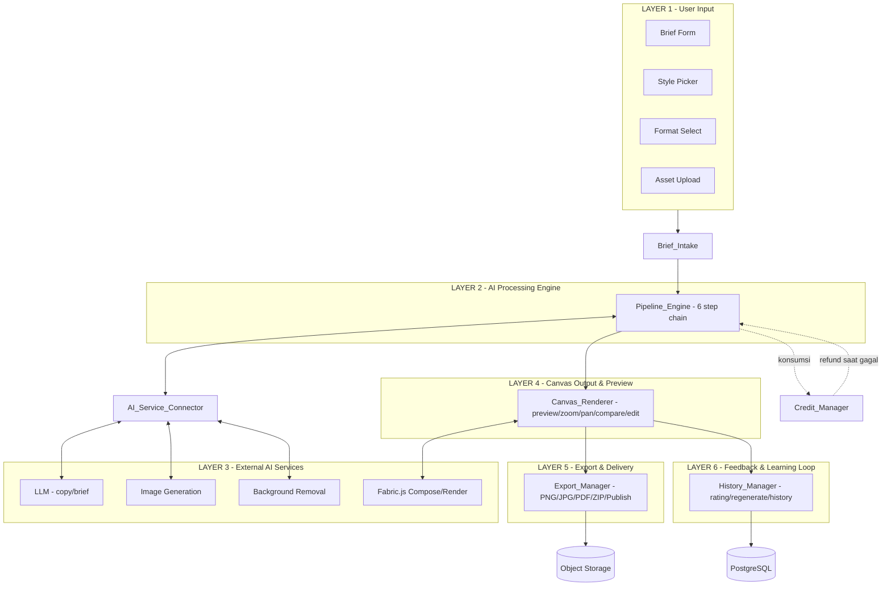
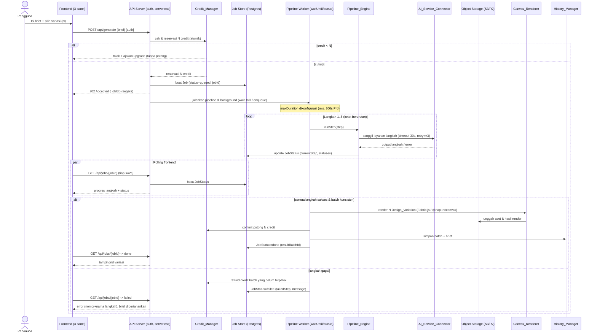
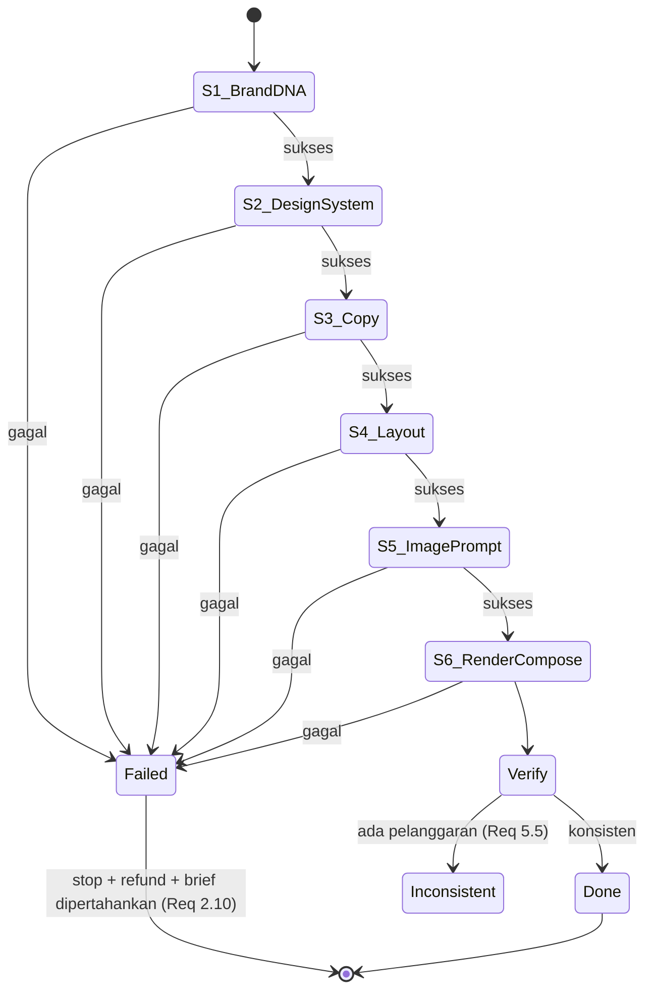
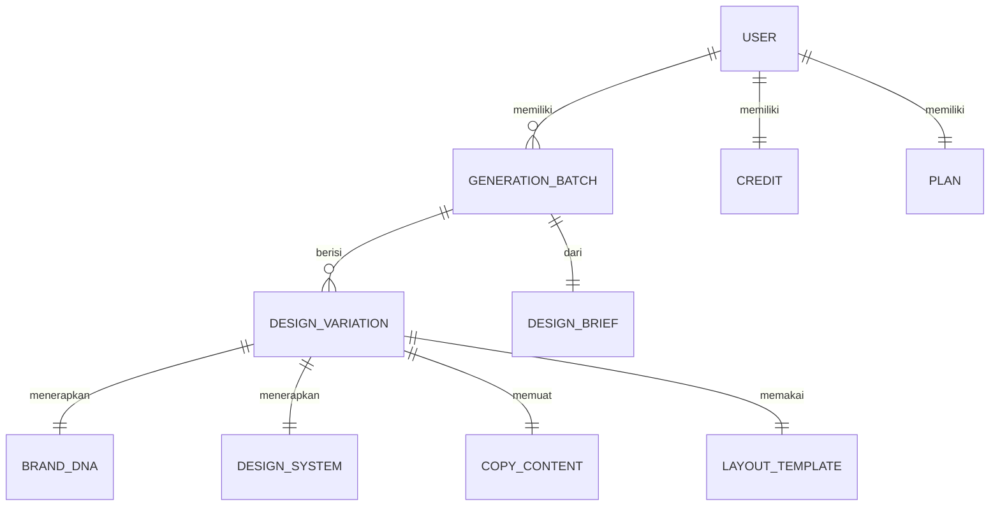

# Design Document

## Overview

Feed Design Generator adalah aplikasi web MVP berbasis AI yang mengubah sebuah *design brief* menjadi rangkaian desain feed media sosial berkualitas profesional. Pembeda inti sistem adalah **pipeline generasi terstruktur 6-langkah** ("Content Design System") yang dijalankan secara berurutan dan ketat: Brand DNA Extraction → Design System Selection → Copy Generation → Layout Composition → Image Prompt Build → Render & Compose. Pendekatan ini menjamin konsistensi identitas brand lintas variasi, bukan sekadar satu gambar yang bagus.

Dokumen ini menerjemahkan delapan requirement menjadi arsitektur konkret: arsitektur 6-layer dan tata letak UI 3-panel, komponen & antarmuka untuk setiap komponen pada glosarium (`Brief_Intake`, `Pipeline_Engine`, `AI_Service_Connector`, `Canvas_Renderer`, `Export_Manager`, `History_Manager`, `Credit_Manager`), model data, mesin status pipeline sekuensial, penanganan kesalahan (retry/timeout/refund kredit), verifikasi konsistensi brand, dan properti korektness untuk property-based testing.

### Tujuan & Batasan MVP

- **Pragmatis & hemat kuota**: memakai stack web umum dan integrasi layanan AI eksternal melalui adapter, bukan membangun model dari nol.
- **Fokus**: alur tunggal brief → batch variasi → preview/edit → ekspor, dengan riwayat dan kredit.
- **Keamanan**: seluruh endpoint yang terekspos jaringan WAJIB diautentikasi (lihat bagian Architecture → Keamanan). Pemanggilan layanan AI eksternal hanya terjadi di sisi server agar API key tidak bocor ke klien.
- **Target deploy: Vercel.com**: struktur kode/berkas WAJIB kompatibel dan dapat berjalan di Vercel (Next.js App Router, API sebagai serverless functions). Karena fungsi serverless bersifat *ephemeral*, ada batas waktu eksekusi, dan tanpa filesystem persisten, model eksekusi pipeline dirancang **asinkron berbasis job** (lihat bagian "Deployment di Vercel"). Detail ini menyesuaikan arsitektur tanpa menambah fitur produk baru.

### Pilihan Stack (rekomendasi pragmatis)

| Lapisan | Pilihan | Alasan |
|---|---|---|
| Frontend | Next.js (React) + TypeScript | Komponen UI 3-panel, SSR/route handler bawaan, ekosistem luas, deploy native di Vercel |
| Canvas | Fabric.js | Diminta requirement; komposisi teks/elemen/gambar interaktif, ekspor ke dataURL |
| Backend API | Next.js App Router Route Handlers (`app/api/*/route.ts`) | Otomatis dideploy sebagai serverless functions di Vercel; endpoint server untuk menyembunyikan kunci AI |
| Orkestrasi pipeline | Modul `Pipeline_Engine` di server (state machine) berbasis **job asinkron** | Kontrol ketat urutan langkah tanpa melebihi batas waktu fungsi serverless |
| Eksekusi background | Vercel `waitUntil` (fluid compute) untuk MVP; opsi skala: queue (mis. Upstash QStash) | Menjalankan pipeline panjang di luar request awal agar tidak melebihi timeout |
| Database | PostgreSQL serverless (mis. **Neon / Supabase / Vercel Postgres**) via Prisma + driver HTTP/pooled (PgBouncer) | Relasional untuk batch/variasi/kredit/transaksi atomik; aman dari kehabisan koneksi di serverless |
| Object storage | S3-compatible (mis. S3/**Cloudflare R2**) | Filesystem fungsi Vercel ephemeral & read-only (kecuali `/tmp`); seluruh aset/render/ekspor disimpan ke storage eksternal |
| Rendering server-side | `@napi-rs/canvas` (bukan `node-canvas`) atau render sisi klien lalu unggah | Kompatibilitas Fabric.js/canvas di lingkungan serverless tanpa binding native bermasalah |
| LLM | Penyedia GPT-4o-class melalui adapter | Copy & analisis brief |
| Image gen | Flux Pro-class melalui adapter | Aset gambar |
| Background removal | Remove.bg-class melalui adapter | Hapus latar aset unggahan |
| PDF CMYK | Library PDF server-side (mis. pdf-lib + profil ICC CMYK) | Ekspor print-ready |

Pemilihan penyedia spesifik bersifat *pluggable* melalui antarmuka `AI_Service_Connector` sehingga MVP dapat berganti vendor tanpa mengubah `Pipeline_Engine`.

## Architecture

### Arsitektur 6-Layer



### Tata Letak UI 3-Panel

```mermaid
flowchart LR
    subgraph LEFT[Panel Kiri - Brief/Configurator]
        direction TB
        F1[Brief Form + Validasi]
        F2[Style/Format/Variasi Picker]
        F3[Asset Upload]
    end
    subgraph CENTER[Panel Tengah - Canvas Output & Preview]
        direction TB
        C1[Grid Variasi 2-4 kolom]
        C2[Zoom 25-400% / Pan]
        C3[Seleksi & Edit]
    end
    subgraph RIGHT[Panel Kanan - Properties/Prompt Chain/History]
        direction TB
        R1[Properties Design_System]
        R2[Prompt Chain Progress 1-6]
        R3[History + Rating]
        R4[Credit Balance]
    end
    LEFT --> CENTER --> RIGHT
```



- **Panel Kiri** memetakan Layer 1 (`Brief_Intake`).
- **Panel Tengah** memetakan Layer 4 (`Canvas_Renderer`) dan titik masuk Layer 5 (ekspor per variasi).
- **Panel Kanan** memetakan indikator progres Layer 2, panel properti edit Layer 4, riwayat & feedback Layer 6, dan saldo `Credit_Manager` (Layer 8/requirement 8).

### Alur Permintaan Generasi (high-level, model job asinkron)

Karena pipeline 6-langkah memanggil beberapa layanan AI secara berurutan (masing-masing timeout 30s), menjalankan keenam langkah dalam satu request sinkron akan melampaui batas waktu fungsi Vercel. Karena itu generasi memakai **pola job asinkron**: `POST /api/generate` mereservasi kredit lalu mengembalikan `jobId` segera; pipeline berjalan sebagai pekerjaan background; frontend melakukan **polling** ke `GET /api/jobs/{jobId}` (≤2s per transisi langkah, selaras Req 2.9).



> **Catatan eksekusi:** langkah-langkah berbiaya waktu tinggi (background removal, image generation) berjalan **di dalam worker job** dengan `maxDuration` memadai, bukan pada request `POST /api/generate` awal. Untuk MVP, satu invokasi worker (`waitUntil`/fluid compute) menjalankan keenam langkah dalam satu fungsi ber-`maxDuration` tinggi; bila satu fungsi tetap berisiko melewati batas, pipeline dipecah menjadi pemanggilan per-langkah (tiap langkah fungsi pendek tersendiri yang dipicu antrian).

### Keamanan (network-exposed endpoints)

> **PENTING — Autentikasi wajib.** Setiap endpoint yang terekspos jaringan (`/api/generate`, `/api/jobs/*`, `/api/variations/*`, `/api/export/*`, `/api/publish/*`, `/api/history/*`, `/api/credits`, `/api/uploads`) WAJIB melewati middleware autentikasi (mis. session/JWT) dan otorisasi kepemilikan sumber daya (pengguna hanya boleh mengakses job/batch/variasi/kredit miliknya). Tanpa lapisan ini, kredit, riwayat, dan biaya layanan AI dapat disalahgunakan.

- API key layanan AI eksternal disimpan sebagai **Vercel Environment Variables** server-side (tanpa prefiks `NEXT_PUBLIC_`); klien tidak pernah memanggil layanan AI secara langsung.
- Validasi & sanitasi seluruh input brief dan berkas unggahan di server (ukuran, MIME, jumlah) selain validasi di klien.
- Operasi kredit dijalankan dalam transaksi DB atomik untuk mencegah race condition dan saldo negatif.

### Deployment di Vercel

Aplikasi dideploy di **Vercel.com**. Bagian ini menjabarkan batasan platform dan keputusan desain yang menyesuaikannya. Tidak ada fitur produk baru; hanya model eksekusi, struktur berkas, penyimpanan, koneksi DB, dan konfigurasi yang diselaraskan dengan platform serverless.

#### 1) Batas waktu eksekusi fungsi serverless

- Fungsi serverless/edge Vercel memiliki batas waktu: Hobby ~10s default (sebagian rute), hingga 60s; Pro hingga 300s dengan konfigurasi `maxDuration`.
- Pipeline 6-langkah memanggil beberapa layanan AI berurutan (masing-masing timeout 30s). Menjalankan keenamnya dalam satu request sinkron **akan melampaui** batas → karena itu dipakai **pola job asinkron** (lihat sequence diagram di atas):
  - `POST /api/generate` → reservasi kredit + buat `Job`, balas `202 { jobId }` segera.
  - Pipeline dijalankan sebagai pekerjaan background.
  - `GET /api/jobs/{jobId}` → frontend polling status (selaras Req 2.9: transisi langkah ter-update ≤2s).
- **Rekomendasi MVP (pragmatis):** jalankan worker via **`waitUntil` (fluid compute)** dalam satu route handler ber-`maxDuration` tinggi.
- **Opsi skala:** queue **Upstash QStash** yang memicu fungsi per-langkah (tiap langkah = fungsi pendek tersendiri), sehingga tidak ada satu fungsi pun yang berjalan lama.
- Konfigurasi durasi melalui **route segment config** atau `vercel.json`:

```ts
// app/api/generate/route.ts (dan worker route)
export const maxDuration = 300; // detik (Pro). Sesuaikan dengan plan.
export const runtime = "nodejs"; // canvas/PDF butuh Node runtime, bukan edge
```

```json
// vercel.json (alternatif konfigurasi terpusat)
{
  "functions": {
    "app/api/generate/route.ts": { "maxDuration": 300 },
    "app/api/jobs/[jobId]/route.ts": { "maxDuration": 15 }
  }
}
```

#### 2) Struktur proyek (Next.js App Router) yang deploy bersih di Vercel

Route handler di bawah `app/api/*/route.ts` otomatis dideploy sebagai serverless functions. Logika komponen glosarium diletakkan di `lib/` agar dapat diuji unit/property tanpa lapisan HTTP.

```
feed-design-generator/
├─ app/
│  ├─ layout.tsx
│  ├─ page.tsx                      # UI 3-panel
│  ├─ middleware.ts                 # auth (atau /middleware.ts root)
│  └─ api/
│     ├─ generate/route.ts          # POST: reservasi kredit + buat job (async)
│     ├─ jobs/
│     │  └─ [jobId]/route.ts        # GET: status job (polling)
│     ├─ variations/[id]/route.ts   # regenerate/fine-tune
│     ├─ export/[id]/route.ts       # PNG/JPG/PDF/ZIP -> unggah ke storage
│     ├─ publish/[id]/route.ts      # publish ke kanal sosial
│     ├─ history/route.ts           # list/load batch
│     ├─ credits/route.ts           # saldo kredit
│     └─ uploads/route.ts           # unggah aset -> storage
├─ lib/
│  ├─ pipeline/engine.ts            # Pipeline_Engine (state machine + job)
│  ├─ pipeline/worker.ts            # eksekusi background (waitUntil/queue handler)
│  ├─ ai/connector.ts              # AI_Service_Connector (adapter vendor)
│  ├─ intake/brief-intake.ts        # Brief_Intake (validasi)
│  ├─ canvas/renderer.ts            # Canvas_Renderer (@napi-rs/canvas / klien)
│  ├─ export/export-manager.ts      # Export_Manager
│  ├─ history/history-manager.ts    # History_Manager
│  ├─ credit/credit-manager.ts      # Credit_Manager
│  ├─ jobs/job-store.ts             # Job/JobStatus persistence (Postgres)
│  └─ storage/object-storage.ts     # adapter S3/R2
├─ prisma/
│  └─ schema.prisma                 # model DB (serverless driver adapter)
├─ tests/                           # property/example/integration tests
├─ vercel.json
└─ package.json
```

#### 3) Tanpa filesystem persisten (ephemeral, read-only kecuali `/tmp`)

- Fungsi Vercel tidak punya disk persisten; hanya `/tmp` yang dapat ditulis dan bersifat sementara per-invokasi.
- Semua aset tergenerasi, hasil render, dan ekspor (ZIP/PDF/PNG/JPG) **WAJIB** diunggah ke **object storage eksternal (S3/R2)**, bukan disimpan ke disk lokal. `Export_Manager` dan `Canvas_Renderer` mengembalikan `FileRef` berisi URL storage.
- **Rendering Fabric.js server-side:** `node-canvas` rapuh di serverless (binding native). Rekomendasi:
  - **MVP:** render di **sisi klien** (Fabric.js di browser) lalu unggah dataURL/blob ke storage via `/api/uploads` — paling sederhana dan menghindari beban CPU fungsi.
  - **Alternatif server-side:** gunakan **`@napi-rs/canvas`** (prebuilt, ramah serverless) di dalam worker job ber-`maxDuration` memadai; `/tmp` hanya untuk file sementara sebelum diunggah.

#### 4) Koneksi database serverless

- Koneksi pooled Postgres tradisional cepat habis pada serverless (tiap invokasi membuka koneksi). Gunakan Postgres serverless dengan **connection pooling**:
  - **Neon / Supabase / Vercel Postgres** dengan **PgBouncer** atau **driver HTTP**.
  - **Prisma** memakai **serverless driver adapter** (mis. `@prisma/adapter-neon`) atau akses berbasis HTTP, dan `DATABASE_URL` menunjuk endpoint *pooled*.
- Transaksi atomik kredit (`reserve → commit/refund`) dan `Job Store` memakai koneksi pooled yang sama.

#### 5) Environment variables / secrets

- Seluruh kunci API AI (LLM, image gen, background removal), kredensial storage, dan `DATABASE_URL` dikonfigurasi sebagai **Vercel Environment Variables** lingkup server (Production/Preview/Development).
- **Dilarang** memakai prefiks `NEXT_PUBLIC_` untuk rahasia, karena variabel ber-prefiks tersebut ter-bundle ke klien. Nilai sensitif hanya diakses dari route handler/server.

#### 6) Pemanggilan eksternal berdurasi panjang (background removal / image gen)

- Pemanggilan ini dapat mendekati batas waktu bila dijalankan di request awal. Karena itu **selalu** dijalankan **di dalam worker job** (langkah pipeline), dengan `maxDuration` memadai dan tetap memakai `callWithRetry` (timeout 30s, ≤3 percobaan). Request `POST /api/generate` awal tidak pernah menunggu pemanggilan ini selesai.

## Components and Interfaces

Antarmuka di bawah ditulis sebagai kontrak TypeScript-style yang merepresentasikan tanggung jawab logis tiap komponen (bukan implementasi final).

### Brief_Intake (Layer 1)

Bertanggung jawab menerima & memvalidasi design brief dan aset unggahan.

```ts
interface BriefIntake {
  validateBrief(input: DesignBriefInput): ValidationResult;     // Req 1.2, 1.3, 1.13
  validateUpload(files: UploadedFile[]): UploadValidationResult; // Req 1.10, 1.11, 1.12
  getOptions(): BriefOptions; // daftar enum tujuan, gaya, tone, format, elemen wajib (Req 1.4-1.9)
}

interface ValidationResult {
  valid: boolean;
  errors: FieldError[];          // mis. { field: "brandName", message: "Nama brand wajib diisi" }
  preservedValues: DesignBriefInput; // nilai field dipertahankan apa adanya (Req 1.3)
}

interface UploadValidationResult {
  accepted: UploadedFile[];
  rejected: { file: string; reason: "format" | "size" | "count"; message: string }[];
}
```

Aturan validasi:
- `brandName` wajib, maks 50 karakter; `tagline` maks 100; `mainMessage` maks 500 (Req 1.13).
- Unggahan: hanya `png/jpg/jpeg`, maks 10 MB/berkas, maks 10 berkas/sesi (Req 1.10–1.12); berkas valid memicu penghapusan latar otomatis.

### Pipeline_Engine (Layer 2)

Menjalankan mesin status 6-langkah secara ketat dan mengoordinasikan konsumsi/refund kredit serta verifikasi konsistensi.

```ts
type StepId = 1 | 2 | 3 | 4 | 5 | 6;
type StepStatus = "pending" | "running" | "done" | "failed";

interface PipelineState {
  current: StepId;
  statuses: Record<StepId, StepStatus>;
  brief: DesignBriefInput;
  brandDna?: BrandDNA;
  designSystem?: DesignSystem;
  copy?: CopyContent;
  layout?: LayoutTemplate;
  imagePrompt?: ImagePrompt;
  batch?: GenerationBatch;
}

interface PipelineEngine {
  // Model job asinkron (Vercel-friendly): buat job lalu jalankan di background worker
  createJob(brief: DesignBriefInput, variationCount: 3 | 6 | 9, userId: string): Promise<Job>; // POST /api/generate -> jobId
  getJobStatus(jobId: string): Promise<JobStatus>; // GET /api/jobs/{jobId} (polling, Req 2.9)
  runJob(jobId: string): Promise<void>;            // dieksekusi worker (waitUntil/queue); menjalankan langkah 1..6

  start(brief: DesignBriefInput, variationCount: 3 | 6 | 9): PipelineState;
  advance(state: PipelineState): PipelineState; // hanya N -> N+1 (Req 2.2)
  runStep(state: PipelineState, step: StepId): Promise<StepResult>;
  regenerateVariation(batch: GenerationBatch, variationId: string): Promise<DesignVariation>; // Req 4.6
  fineTuneVariation(source: DesignVariation, feedback: string): Promise<DesignVariation>;      // Req 7.6
  verifyConsistency(batch: GenerationBatch): ConsistencyReport; // Req 5.5, 5.6
}

interface ConsistencyReport {
  consistent: boolean;
  violations: { variationId: string; attribute: "brandDna" | "accentPalette" | "headlineFont" | "bodyFont" | "mandatoryElement"; detail: string }[];
}
```

**Mesin status pipeline (ketat sekuensial):**



Aturan transisi: dari langkah `N` hanya boleh ke `N+1` saat sukses, atau ke `Failed` saat gagal. Tidak boleh melompat, mundur, atau mengulang langkah lain (Req 2.2). Saat `Failed`, proses berhenti pada langkah tersebut, pesan menyebut nomor+nama langkah, kredit yang belum terpakai dikembalikan, brief dipertahankan (Req 2.10).

### AI_Service_Connector (Layer 3)

Adapter ke layanan AI eksternal dengan timeout, retry, dan regenerasi.

```ts
interface AIServiceConnector {
  generateCopy(req: CopyRequest): Promise<CopyContent>;     // Req 3.1
  generateImage(req: ImageRequest): Promise<ImageAsset>;    // Req 3.2
  removeBackground(asset: UploadedFile): Promise<ImageAsset>; // Req 3.4
  // Pembungkus umum: timeout 30s, maksimal 3 percobaan per langkah (Req 3.5, 3.6)
  callWithRetry<T>(fn: () => Promise<T>, opts: { timeoutMs: 30000; maxAttempts: 3; step: StepId }): Promise<T>;
}
```

Perilaku kegagalan (Req 3.5–3.7):
- Timeout 30 detik atau error → tampilkan pesan dengan langkah yang gagal, pertahankan input & hasil langkah sebelumnya, tawarkan retry.
- Maks 3 percobaan per langkah.
- Setiap langkah sukses menyediakan opsi regenerasi manual.

### Canvas_Renderer (Layer 4)

Menyusun & merender variasi pada canvas Fabric.js, serta menyediakan preview/zoom/pan/compare/edit.

```ts
interface CanvasRenderer {
  composeVariation(spec: VariationSpec): DesignVariation;       // Req 3.3
  renderBatch(batch: GenerationBatch): void;                    // Req 4.1 (<=2s, <=20 variasi)
  setZoom(level: number): void;     // 25%..400% (Req 4.2)
  pan(dx: number, dy: number): void; // dibatasi area konten (Req 4.2)
  setGridColumns(cols: 2 | 3 | 4): void; // Req 4.3
  selectVariation(id: string): EditControls; // <=500ms (Req 4.4)
  applyDesignSystemChange(change: DesignSystemPatch): void; // <=1s (Req 4.5)
  ensureMandatoryElements(batch: GenerationBatch, elements: MandatoryElement[]): boolean; // Req 5.4
}
```

### Export_Manager (Layer 5)

```ts
interface ExportManager {
  exportImage(v: DesignVariation, fmt: "png" | "jpg"): Promise<FileRef>; // >=1080px sisi terpendek, <=30s (Req 6.1)
  exportPdf(v: DesignVariation): Promise<FileRef>;     // CMYK print-ready (Req 6.2)
  exportBatchZip(batch: GenerationBatch): Promise<FileRef>; // ZIP semua variasi (Req 6.3)
  publish(v: DesignVariation, channel: "instagram" | "facebook" | "linkedin"): Promise<PublishResult>; // <=60s (Req 6.4), retry<=3 (Req 6.7)
}
```

Variasi selalu dipertahankan terlepas dari hasil ekspor/publikasi (Req 6.5, 6.6, 6.8).

### History_Manager (Layer 6)

```ts
interface HistoryManager {
  saveBatch(batch: GenerationBatch, brief: DesignBriefInput): Promise<void>; // <=2s (Req 7.1), retry persist (Req 7.7)
  listBatches(page: number): Promise<GenerationBatch[]>; // urut terbaru, <=20/halaman (Req 7.2)
  loadBatch(batchId: string): Promise<{ batch: GenerationBatch; brief: DesignBriefInput }>; // <=3s (Req 7.3)
  rateVariation(variationId: string, rating: number): RatingResult; // 1..5 integer (Req 7.4, 7.8), retry persist diam-diam (Req 7.5)
}

interface RatingResult {
  accepted: boolean;       // false jika di luar 1..5
  storedRating?: number;   // rating sebelumnya dipertahankan jika ditolak
  message?: string;
}
```

### Credit_Manager (Requirement 8)

```ts
interface CreditManager {
  getBalance(userId: string): Promise<number>;     // bilangan bulat >=0 (Req 8.1, 8.6)
  canAfford(userId: string, variationCount: number): Promise<boolean>; // Req 8.3
  reserve(userId: string, amount: number): Promise<ReservationResult>; // atomik
  commit(reservationId: string): Promise<void>;    // potong 1 credit/variasi (Req 8.2)
  refund(reservationId: string): Promise<void>;    // Req 2.10
  isVariationCountAllowed(plan: Plan, count: 3 | 6 | 9): boolean; // 9 hanya Pro (Req 8.4, 8.5)
}
```

Konsumsi kredit memakai pola **reserve → commit/refund** dalam transaksi atomik agar saldo tidak pernah < 0 dan refund tepat saat pipeline gagal.

## Data Models

```ts
// Input brief (Layer 1)
interface DesignBriefInput {
  brandName: string;        // wajib, <=50
  tagline?: string;         // <=100
  mainMessage?: string;     // <=500
  contentGoal: "Rekrutmen" | "Promosi" | "Branding" | "Edukasi" | "Engagement" | "Report"; // Req 1.4
  visualStyle: "BoldDark" | "VibrantCleanModern" | "CorporateBlue" | "Minimalis" | "WarmEarth" | "NeonCyber" | "Luxury" | "Gradient"; // Req 1.5
  tone: "Profesional" | "Energik" | "Edukatif" | "Minimalis" | "Friendly" | "Formal"; // Req 1.6
  outputFormat: OutputFormat; // Req 1.7
  variationCount: 3 | 6 | 9;  // Req 1.8
  accentPalette: string[];    // nilai warna hex
  mandatoryElements: MandatoryElement[]; // Req 1.9
  uploadedAssets: ImageAsset[];
}

type OutputFormat =
  | { name: "InstagramFeed"; width: 1080; height: 1350 }
  | { name: "Carousel"; width: 1080; height: 1080 }
  | { name: "StoryReel"; width: 1080; height: 1920 }
  | { name: "Square"; width: 1080; height: 1080 }
  | { name: "Landscape"; width: 1200; height: 628 };

type MandatoryElement = "LogoStrip" | "CTAButton" | "StatCards" | "QRCode" | "BadgeFloating" | "ProgressBar"; // Req 1.9

// Langkah 1
interface BrandDNA {
  brandName: string;
  tagline?: string;
  accentPalette: string[]; // identik untuk seluruh variasi (Req 5.2)
  tone: string;
  visualStyle: string;
}

// Langkah 2
interface DesignSystem {
  headlineFont: string; // identik untuk seluruh variasi (Req 5.3)
  bodyFont: string;     // identik untuk seluruh variasi (Req 5.3)
  typographyScale: number[];
  radius: number;
  layoutDensity: "compact" | "regular" | "spacious";
  brandElementPosition: { logo: string; watermark?: string };
  ctaStyle: string;
}

// Langkah 3
interface CopyContent {
  headline: string;
  subHeadline?: string;
  body?: string;
  cta: string;
  alignedGoal: string; // sesuai contentGoal
  alignedTone: string; // sesuai tone (Req 2.5)
}

// Langkah 4
interface LayoutTemplate {
  id: string;
  format: OutputFormat;        // sesuai Output_Format (Req 2.6)
  slots: LayoutSlot[];
  includedElements: MandatoryElement[]; // mencakup seluruh elemen wajib
}

interface LayoutSlot { type: "text" | "image" | "element"; x: number; y: number; w: number; h: number }

// Langkah 5
interface ImagePrompt {
  prompt: string;     // gabungan BrandDNA + DesignSystem + LayoutTemplate (Req 2.7)
  negativePrompt?: string;
  seed?: number;
}

// Langkah 6 / output
interface DesignVariation {
  id: string;
  batchId: string;
  brandDna: BrandDNA;       // identik antarvariasi
  designSystem: DesignSystem; // identik antarvariasi
  copy: CopyContent;
  layout: LayoutTemplate;
  imageAsset: ImageAsset;
  renderedCanvas: CanvasRef; // hasil Fabric.js
  rating?: number;           // 1..5
}

interface GenerationBatch {
  id: string;
  userId: string;
  briefId: string;
  variations: DesignVariation[]; // jumlah == variationCount (Req 2.8)
  status: "running" | "done" | "failed" | "inconsistent";
  createdAt: string;
}

// Job asinkron (eksekusi pipeline di Vercel serverless background)
type JobState = "queued" | "running" | "done" | "failed";

interface Job {
  id: string;          // jobId yang dikembalikan POST /api/generate
  userId: string;      // otorisasi kepemilikan (hanya pemilik boleh polling)
  briefId: string;
  variationCount: 3 | 6 | 9;
  reservationId: string; // kredit yang direservasi untuk batch ini (reserve->commit/refund)
  createdAt: string;
}

interface JobStatus {
  jobId: string;
  state: JobState;
  currentStep: StepId;                 // langkah aktif (untuk indikator progres, Req 2.9)
  statuses: Record<StepId, StepStatus>; // status tiap langkah 1..6
  resultBatchId?: string;              // terisi saat state == "done"
  failedStep?: StepId;                 // terisi saat state == "failed"
  message?: string;                    // pesan kesalahan menyebut nomor+nama langkah (Req 2.10)
  updatedAt: string;                   // diperbarui ≤2s per transisi (Req 2.9)
}

// Monetisasi
type Plan = "Free" | "Pro";

interface Credit {
  userId: string;
  balance: number; // integer >= 0 (Req 8.6)
}

interface ImageAsset { id: string; url: string; width: number; height: number }
interface FileRef { url: string; format: string; bytes: number }
```

### Relasi Data



## Correctness Properties

*Sebuah properti adalah karakteristik atau perilaku yang harus selalu benar di seluruh eksekusi sistem yang valid — pada dasarnya sebuah pernyataan formal tentang apa yang seharusnya dilakukan sistem. Properti menjadi jembatan antara spesifikasi yang dapat dibaca manusia dan jaminan korektness yang dapat diverifikasi mesin.*

Properti berikut diturunkan dari prework analysis. Beberapa acceptance criteria yang bersifat integrasi layanan eksternal (3.1–3.4, 6.4), konfigurasi/enum statis (1.4–1.9, 4.3, 6.2), atau murni timing/UI (sebagian 2.9, 4.1, 4.4, 4.5) tidak ditulis sebagai properti dan ditangani melalui integration test, example test, atau snapshot test (lihat Testing Strategy).

### Property 1: Validasi nama brand wajib

*Untuk setiap* design brief yang nilai `brandName`-nya kosong atau hanya berisi whitespace, validasi harus menolak permintaan dan seluruh nilai field lain pada `preservedValues` harus identik dengan input semula.

**Validates: Requirements 1.2, 1.3**

### Property 2: Batas karakter field teks

*Untuk setiap* string masukan, field `brandName` ditolak bila panjangnya > 50, `tagline` ditolak bila > 100, dan `mainMessage` ditolak bila > 500; bila berada dalam batas, field tersebut diterima.

**Validates: Requirements 1.13**

### Property 3: Validasi berkas unggahan

*Untuk setiap* daftar berkas unggahan, hanya berkas berformat PNG/JPG/JPEG dengan ukuran ≤ 10 MB yang diterima selama total berkas yang diterima tidak melebihi 10 per sesi; berkas dengan format tak didukung ditolak dengan alasan "format", berkas > 10 MB atau yang melebihi kuota 10 ditolak dengan alasan "size"/"count".

**Validates: Requirements 1.10, 1.11, 1.12**

### Property 4: Eksekusi pipeline berurutan ketat

*Untuk setiap* brief valid, urutan langkah yang dieksekusi pipeline persis sama dengan [1, 2, 3, 4, 5, 6], dan dari state mana pun `advance` hanya menghasilkan `current + 1` (tidak pernah melompat, mundur, atau mengulang langkah lain).

**Validates: Requirements 2.1, 2.2**

### Property 5: Brand DNA diturunkan dari brief

*Untuk setiap* brief valid, `BrandDNA` hasil langkah 1 memiliki `brandName`, `accentPalette`, `tone`, dan `visualStyle` yang sama persis dengan nilai pada brief.

**Validates: Requirements 2.3**

### Property 6: Copy selaras dengan tujuan dan tone

*Untuk setiap* brief valid, `CopyContent` hasil langkah 3 memiliki `alignedGoal` sama dengan `contentGoal` brief dan `alignedTone` sama dengan `tone` brief.

**Validates: Requirements 2.5**

### Property 7: Layout selaras dengan format dan elemen wajib

*Untuk setiap* brief valid, `LayoutTemplate` hasil langkah 4 memiliki `format` sama dengan `outputFormat` brief dan `includedElements` mencakup (superset) seluruh `mandatoryElements` yang dipilih.

**Validates: Requirements 2.6**

### Property 8: Image prompt menggabungkan tiga sumber

*Untuk setiap* kombinasi `BrandDNA`, `DesignSystem`, dan `LayoutTemplate`, `ImagePrompt.prompt` hasil langkah 5 memuat penanda yang berasal dari ketiga sumber tersebut (identitas brand, font, dan struktur layout).

**Validates: Requirements 2.7**

### Property 9: Jumlah variasi batch sesuai pilihan

*Untuk setiap* nilai `variationCount` yang valid (3, 6, atau 9), `GenerationBatch` hasil langkah 6 berisi tepat sebanyak `variationCount` `DesignVariation`.

**Validates: Requirements 2.8**

### Property 10: Indikator progres mencerminkan state pipeline

*Untuk setiap* state pipeline (dipublikasikan melalui `JobStatus`), indikator progres yang dipaparkan menunjukkan nomor langkah aktif yang sama dengan `currentStep`, nama langkah yang sesuai, dan status setiap langkah yang sama dengan `statuses` — sehingga hasil polling `GET /api/jobs/{jobId}` selalu konsisten dengan state internal worker.

**Validates: Requirements 2.9**

### Property 11: Kegagalan langkah menghentikan proses, refund, dan mempertahankan brief

*Untuk setiap* kegagalan pada langkah K mana pun, pipeline berhenti tepat di langkah K, pesan kesalahan menyebut nomor dan nama langkah K, seluruh credit yang belum terpakai untuk batch dikembalikan (saldo kembali ke nilai sebelum generasi), dan isi design brief tetap tidak berubah.

**Validates: Requirements 2.10**

### Property 12: Hasil langkah sebelumnya dipertahankan saat kegagalan pemanggilan AI

*Untuk setiap* kegagalan pemanggilan layanan AI pada langkah K, seluruh hasil langkah 1..K-1 tetap utuh tanpa perubahan dan opsi mencoba ulang tersedia.

**Validates: Requirements 3.5**

### Property 13: Batas maksimum percobaan ulang

*Untuk setiap* operasi yang terus gagal, jumlah percobaan tidak pernah melebihi 3 — baik untuk pemanggilan layanan AI per langkah maupun untuk publikasi per permintaan.

**Validates: Requirements 3.6, 6.7**

### Property 14: Kontrol zoom dan pan terbatas

*Untuk setiap* nilai zoom yang diminta, level zoom efektif selalu di-clamp ke rentang [25%, 400%]; dan *untuk setiap* operasi pan, offset hasil tidak pernah melewati batas area konten preview.

**Validates: Requirements 4.2**

### Property 15: Operasi turunan variasi mempertahankan brand

*Untuk setiap* `DesignVariation` sumber, hasil regenerasi maupun fine-tune memiliki `BrandDNA` dan `DesignSystem` yang identik dengan variasi sumber.

**Validates: Requirements 4.6, 7.6**

### Property 16: Kegagalan operasi turunan mempertahankan variasi asal

*Untuk setiap* kegagalan regenerasi atau fine-tune sebuah `DesignVariation`, variasi asal tetap tidak berubah.

**Validates: Requirements 4.7, 7.9**

### Property 17: Konsistensi brand lintas variasi dalam satu batch

*Untuk setiap* `GenerationBatch` yang ditandai selesai, seluruh `DesignVariation` di dalamnya memiliki `BrandDNA` identik, `accentPalette` identik, `headlineFont` dan `bodyFont` identik, serta setiap elemen wajib yang dipilih hadir pada 100% variasi.

**Validates: Requirements 5.1, 5.2, 5.3, 5.4, 5.6**

### Property 18: Deteksi dan pelaporan ketidakkonsistenan

*Untuk setiap* `GenerationBatch` yang memuat minimal satu variasi yang menyimpang pada `BrandDNA`, palet warna aksen, atau font, `verifyConsistency` mengembalikan `consistent == false`, melaporkan variasi dan atribut spesifik yang menyimpang, batch ditandai `inconsistent`, dan variasi yang sudah berhasil dibuat tetap dipertahankan.

**Validates: Requirements 5.5**

### Property 19: Resolusi ekspor gambar

*Untuk setiap* `DesignVariation`, berkas hasil ekspor PNG atau JPG memiliki sisi terpendek ≥ 1080 piksel.

**Validates: Requirements 6.1**

### Property 20: Kelengkapan isi ZIP batch

*Untuk setiap* `GenerationBatch`, berkas ZIP hasil ekspor batch berisi tepat sejumlah entri yang sama dengan jumlah `DesignVariation` pada batch tersebut.

**Validates: Requirements 6.3**

### Property 21: Variasi dipertahankan terlepas dari hasil ekspor/publikasi

*Untuk setiap* `DesignVariation`, setelah operasi ekspor atau publikasi dengan hasil apa pun (sukses atau gagal), variasi tersebut tetap tidak berubah dan masih dapat diekspor atau dipublikasikan ulang.

**Validates: Requirements 6.5, 6.6, 6.8**

### Property 22: Round-trip simpan dan muat riwayat

*Untuk setiap* `GenerationBatch` beserta brief terkait, menyimpannya ke riwayat lalu memuatnya kembali menghasilkan batch dan brief yang setara dengan aslinya.

**Validates: Requirements 7.1, 7.3**

### Property 23: Pengurutan dan paginasi riwayat

*Untuk setiap* himpunan `GenerationBatch`, hasil `listBatches` terurut dari `createdAt` terbaru ke terlama dan tidak pernah memuat lebih dari 20 entri per halaman.

**Validates: Requirements 7.2**

### Property 24: Validasi rentang rating

*Untuk setiap* nilai rating: bila berupa bilangan bulat 1..5 maka diterima dan disimpan bersama variasi; bila di luar rentang itu (non-integer atau di luar 1..5) maka ditolak dan rating sebelumnya (jika ada) dipertahankan.

**Validates: Requirements 7.4, 7.8**

### Property 25: Ketahanan rating saat penyimpanan tidak tersedia

*Untuk setiap* rating valid yang diberikan ketika penyimpanan tidak tersedia, rating tetap diterima dan ditampilkan pada antarmuka, sistem mencoba menyimpan ulang maksimal 3 kali, dan tidak ada pesan kesalahan yang ditampilkan kepada pengguna.

**Validates: Requirements 7.5**

### Property 26: Data batch dipertahankan saat penyimpanan riwayat gagal

*Untuk setiap* kegagalan penyimpanan `GenerationBatch` ke riwayat, data batch pada sesi aktif tetap utuh tanpa perubahan.

**Validates: Requirements 7.7**

### Property 27: Pengurangan kredit sesuai jumlah variasi

*Untuk setiap* batch yang berhasil dihasilkan dengan N variasi, saldo credit berkurang tepat N (1 credit per variasi).

**Validates: Requirements 8.2**

### Property 28: Penolakan saat kredit tidak mencukupi

*Untuk setiap* permintaan generasi dengan saldo credit lebih kecil dari jumlah variasi yang diminta, permintaan ditolak, saldo credit tidak berubah, dan ditampilkan ajakan upgrade ke Pro.

**Validates: Requirements 8.3**

### Property 29: Aturan kelayakan jumlah variasi berbasis plan

*Untuk setiap* plan: plan "Free" tidak mengizinkan pilihan 9 variasi (hanya 3 dan 6), sedangkan plan "Pro" mengizinkan 3, 6, dan 9 variasi.

**Validates: Requirements 8.4, 8.5**

### Property 30: Invariant saldo kredit non-negatif

*Untuk setiap* barisan operasi kredit (reserve, commit, refund) dengan urutan apa pun, saldo credit yang dilaporkan selalu berupa bilangan bulat dan tidak pernah bernilai kurang dari 0.

**Validates: Requirements 8.1, 8.6**

## Error Handling

Strategi penanganan kesalahan dikelompokkan per sumber kegagalan dan dirancang agar input pengguna serta hasil parsial tidak pernah hilang.

### Kegagalan validasi input (Brief_Intake)
- Validasi field & berkas dilakukan di klien dan diverifikasi ulang di server.
- Pesan kesalahan spesifik per field/berkas; seluruh nilai field yang sudah diisi dipertahankan (Req 1.3).
- Berkas yang melanggar format/ukuran/jumlah ditolak satu per satu dengan alasan yang jelas, tanpa membatalkan berkas valid lainnya.

### Kegagalan langkah pipeline (Pipeline_Engine)
- Setiap langkah dibungkus dalam blok try/catch dengan transisi ke state `Failed` yang menyimpan nomor & nama langkah.
- Saat gagal: proses berhenti, `JobStatus.state="failed"` dengan `failedStep` & `message`, **kredit yang belum terpakai di-refund** melalui `Credit_Manager.refund`, dan brief dipertahankan (Req 2.10).
- Verifikasi konsistensi pasca-render: bila ada pelanggaran, batch ditandai `inconsistent` dengan detail variasi+atribut, variasi sukses tetap disimpan (Req 5.5).

### Kegagalan eksekusi job/background (Vercel serverless)
- Jika worker (`waitUntil`/queue) gagal dimulai atau timeout sebelum selesai, `JobStatus` tetap dapat di-polling dan menampilkan state terakhir; job yang macet dianggap gagal sehingga kredit di-refund dan brief dipertahankan (Req 2.10).
- Polling `GET /api/jobs/{jobId}` bersifat idempoten dan hanya membaca state; tidak memicu eksekusi ulang pipeline.
- Pada model per-langkah berbasis queue, kegagalan satu langkah tidak memicu langkah berikutnya (urutan ketat tetap terjaga, Req 2.2).

### Kegagalan storage eksternal (Object Storage)
- Render/ekspor yang gagal diunggah ke S3/R2 diperlakukan sebagai kegagalan langkah/ekspor terkait; karena tidak ada disk persisten, tidak ada fallback ke filesystem lokal.
- `Export_Manager` mengembalikan pesan penyebab dan variasi tetap dipertahankan (Req 6.8); operasi dapat diulang.

### Kegagalan layanan AI eksternal (AI_Service_Connector)
- Timeout 30 detik per pemanggilan (Req 3.5).
- Pola `callWithRetry`: maksimal 3 percobaan per langkah (Req 3.6); antar percobaan dapat memakai backoff sederhana.
- Saat tetap gagal: pesan menunjuk langkah, hasil langkah sebelumnya dipertahankan, opsi retry manual ditawarkan.

### Kegagalan ekspor/publikasi (Export_Manager)
- Ekspor gagal (PNG/JPG/PDF/ZIP) → variasi dipertahankan + pesan penyebab (Req 6.8).
- Publikasi gagal → variasi dipertahankan + pesan penyebab; retry hingga 3 kali per permintaan (Req 6.6, 6.7).
- Variasi selalu dapat diekspor/dipublikasikan ulang (Req 6.5).

### Kegagalan persistensi (History_Manager)
- Simpan batch gagal → data batch dipertahankan di sesi + indikasi error (Req 7.7).
- Simpan rating gagal → rating tetap tampil di UI, retry diam-diam hingga 3 kali tanpa pesan error (Req 7.5).
- Rating di luar 1..5 → ditolak, rating lama dipertahankan, indikasi error (Req 7.8).

### Kegagalan kredit (Credit_Manager)
- Operasi reserve/commit/refund dalam transaksi DB atomik untuk mencegah saldo negatif dan race condition (Req 8.6).
- Kredit tidak cukup → tolak tanpa potong + ajakan upgrade (Req 8.3).

### Keamanan & autentikasi
- Permintaan tak terautentikasi pada endpoint mana pun ditolak dengan 401; akses lintas-pengguna ditolak dengan 403.

## Testing Strategy

Pendekatan pengujian bersifat ganda: **property-based tests** untuk properti universal dan **example/integration/smoke tests** untuk hal yang tidak cocok diuji secara properti.

### Property-Based Testing

PBT diterapkan karena bagian inti sistem adalah logika murni dengan properti universal: validasi, mesin status pipeline sekuensial, verifikasi konsistensi, aritmetika kredit, pengurutan riwayat, dan invariant clamp. Layanan AI eksternal **di-mock** agar properti menguji logika kita, bukan vendor, dan tetap hemat biaya untuk 100+ iterasi.

- Library: gunakan library PBT mapan untuk target language (mis. **fast-check** untuk TypeScript/Node). Tidak menulis framework PBT dari nol.
- Setiap properti diimplementasikan oleh **satu** property-based test.
- Setiap test dikonfigurasi minimal **100 iterasi**.
- Setiap test diberi tag komentar dengan format: **Feature: feed-design-generator, Property {number}: {property_text}**.
- Generator menyertakan edge case: string whitespace/panjang batas, palet kosong, daftar elemen wajib bervariasi, jumlah variasi 3/6/9, ukuran berkas tepat di 10 MB, rating non-integer & di luar 1..5, barisan operasi kredit acak.
- Properti yang dipetakan: Property 1–30 di atas.

### Example-Based Unit Tests

Untuk acceptance criteria yang spesifik/konfigurasi:
- Daftar opsi enum brief (Req 1.4–1.9) — `getOptions()`.
- Grid kolom 2–4 (Req 4.3), kontrol edit saat seleksi (Req 4.4), update preview saat properti berubah (Req 4.5).
- Opsi regenerasi manual tersedia pada langkah sukses (Req 3.7).
- Ruang warna CMYK pada PDF (Req 6.2) — pemeriksaan metadata.

### Integration Tests (1–3 contoh, layanan eksternal di-mock atau sandbox)

- Pemanggilan LLM, image generation, compose/render, dan background removal (Req 3.1–3.4): verifikasi connector dipanggil dengan argumen benar dan menangani respons.
- Publikasi ke Instagram/Facebook/LinkedIn (Req 6.4): verifikasi pengiriman ke kanal yang benar.
- Alur job asinkron: `POST /api/generate` membalas `jobId`, worker menjalankan langkah, `GET /api/jobs/{jobId}` melaporkan progres lalu `done`/`failed` (storage & AI di-mock).
- Unggah aset/ekspor ke object storage (S3/R2) menghasilkan `FileRef` URL (storage di-mock/sandbox).
- Alur end-to-end brief → job → batch → ekspor sebagai satu jalur happy-path.

### Smoke / Performance Tests

- Timing/perf yang disebut requirement (update progres polling ≤ 2s, render batch ≤ 2s, seleksi ≤ 500ms, update preview ≤ 1s, ekspor ≤ 30s, publish ≤ 60s, simpan/muat riwayat ≤ 2s/3s, saldo kredit ≤ 2s) diverifikasi sebagai pengujian kinerja/asersi waktu terpisah, bukan sebagai properti.
- Smoke test autentikasi: endpoint (termasuk `/api/jobs/*`) menolak permintaan tanpa kredensial dan akses lintas-pengguna.
- Smoke test deploy Vercel: route handler memakai `runtime = "nodejs"` dan `maxDuration` terkonfigurasi; rahasia tidak ber-prefiks `NEXT_PUBLIC_`; koneksi DB memakai endpoint pooled.

### Catatan Cakupan PBT

Bagian berikut **tidak** memakai PBT sesuai panduan: integrasi layanan AI/publikasi eksternal (deterministik terhadap vendor), rendering/layout UI Fabric.js (gunakan snapshot/visual test bila perlu), enum/konfigurasi statis, dan asersi timing murni.
